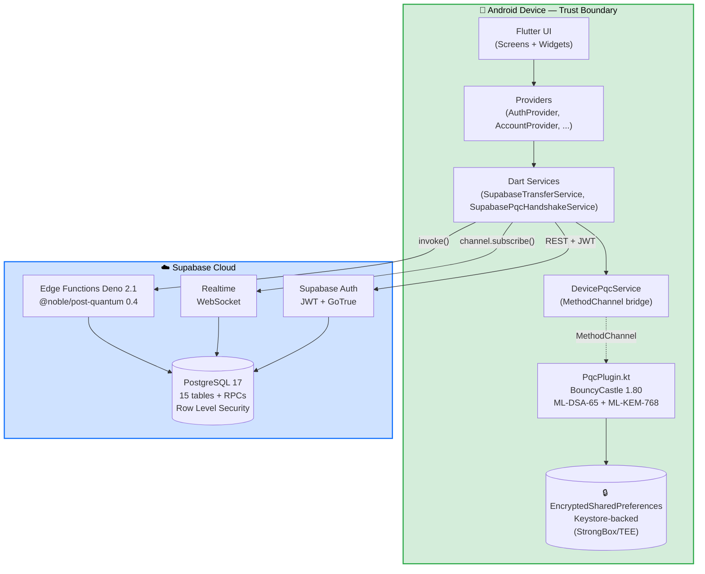
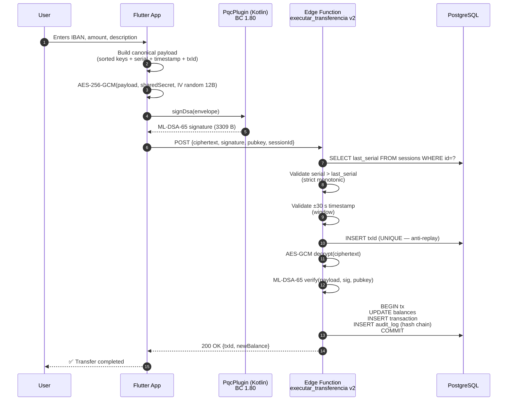
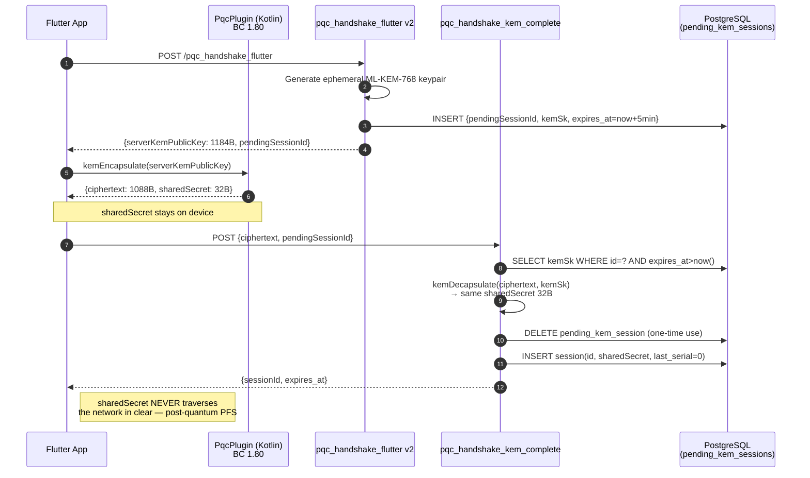
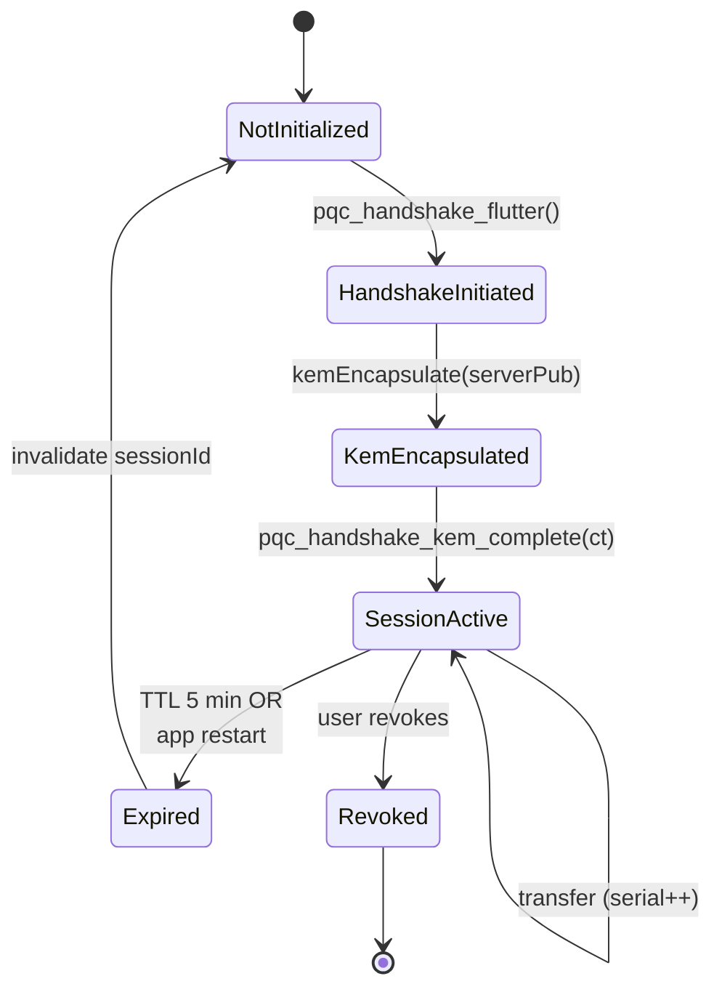
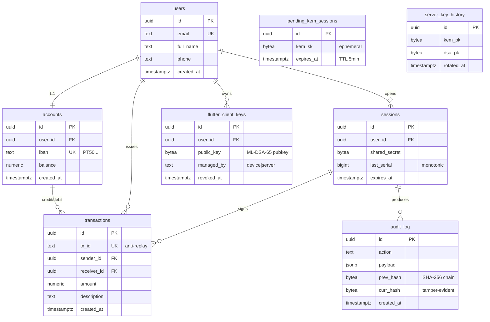
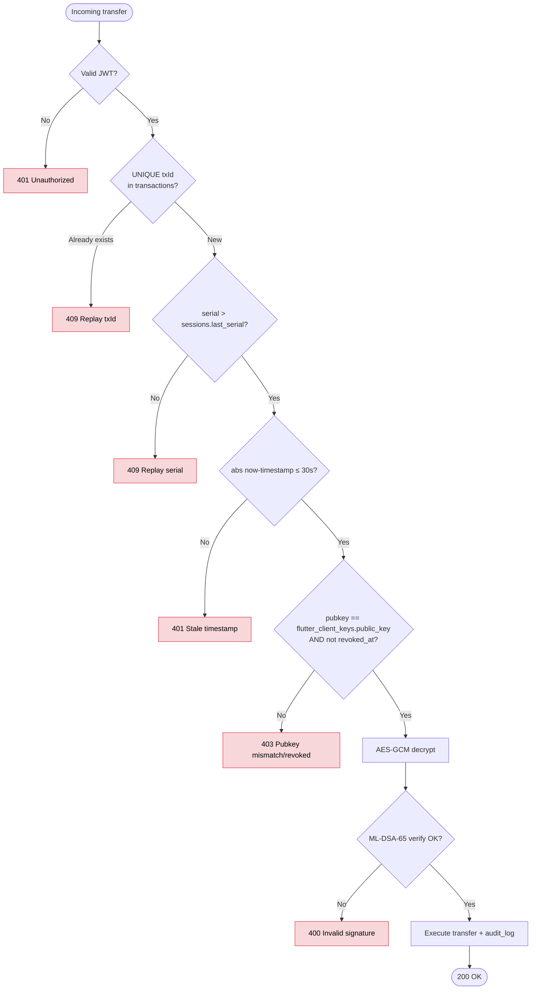
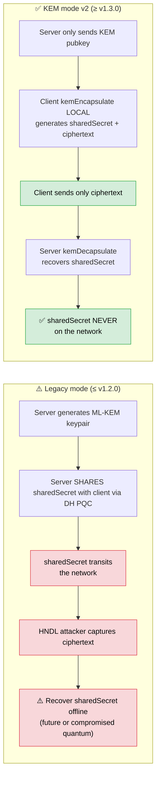

<div align="center">


# BJBank — Post-Quantum Mobile Banking

### Post-Quantum Cryptography in Mobile Applications
### A Resilient Protocol Proposal for Home Banking Environments

[](https://docs.flutter.dev)
[](https://dart.dev)
[](https://supabase.com)
[](https://csrc.nist.gov/projects/post-quantum-cryptography)
[](https://www.bouncycastle.org)
[](CHANGELOG.md)
[]()

<br/>


**Master's Thesis · Polytechnic Institute of Guarda · 2026**

<br/>

<table>
  <tr>
    <td align="center" width="50%">
      <br/>
      <b>Vagner Bom Jesus</b><br/>
      <sub>Author · MSc Candidate in Computer Engineering</sub><br/>
      <sub>Polytechnic Institute of Guarda (IPG)</sub><br/>
      <a href="mailto:vagneripg@gmail.com">vagneripg@gmail.com</a> ·
      <a href="https://github.com/VagnerBomJesus">GitHub</a>
    </td>
    <td align="center" width="50%">
      <br/>
      <b>Prof. Dr. Rui A. P. Perdigão</b><br/>
      <sub>Supervisor</sub><br/>
      <sub>Physics of Information, Complexity &amp; Predictability</sub><br/>
      <a href="https://fluiddynamicalsystems.eu">fluiddynamicalsystems.eu</a>
    </td>
  </tr>
</table>

</div>

---

## Abstract

Large-scale quantum computing renders obsolete the classical cryptographic protocols (RSA, ECDSA, ECDH) that currently protect mobile banking. The **Harvest-Now-Decrypt-Later (HNDL)** attack is already underway — adversaries capture encrypted traffic today to decrypt it once a practical quantum computer becomes available.

This dissertation proposes a **resilient communication protocol for home banking** based on NIST-standardised post-quantum cryptography (PQC): **ML-KEM-768** (FIPS 203, key encapsulation), **ML-DSA-65** (FIPS 204, digital signature), and **SLH-DSA-SHAKE-128f** (FIPS 205, hash-based signature for defence in depth, lattice-independent). The protocol is validated by a functional Android implementation (`BJBank`), with private keys residing in **StrongBox/TEE** and **post-quantum Perfect Forward Secrecy** delivered through ephemeral on-device KEM handshakes.

**Keywords:** post-quantum cryptography, mobile banking, ML-DSA, ML-KEM, NIST FIPS 203, NIST FIPS 204, NIST FIPS 205, BouncyCastle, Android, Flutter, StrongBox, TEE, Perfect Forward Secrecy, harvest-now-decrypt-later, lattice cryptography, hash-based signatures, key encapsulation mechanism, digital signature algorithm.

---

## Experimental Results

> Benchmark v1.4.0 (`fair-runtime`) executed on Android emulator SDK 36 (x86_64), BouncyCastle 1.80 native, 100 iterations per operation. **No physical ARM device measurements yet — see [`THESIS_READINESS.md`](docs/THESIS_READINESS.md).**

### PQC vs Classical on the same runtime (BC 1.80 JVM native)

| Operation | PQC (BC native) | Classical (BC native) | P50 Ratio | Interpretation |
|---|---:|---:|---:|---|
| **Sign** | ML-DSA-65: **5.22 ms** | ECDSA-P256: 3.57 ms | **1.46×** | PQC 46% slower |
| **Verify** | ML-DSA-65: **1.35 ms** | ECDSA-P256: 3.97 ms | **0.34×** | **PQC 3× FASTER** |
| **Keygen** | ML-DSA-65: **4.73 ms** | ECDSA-P256: 3.83 ms | **1.24×** | Effectively tied |
| **KEM/DH** | ML-KEM-768 encap: **2.62 ms** | ECDH-P256 agree: 14.99 ms | **0.17×** | **PQC 5.7× FASTER** |
| **Hash-based sign (defence in depth)** | SLH-DSA-SHAKE-128f: **202.8 ms** | — | — | Reserved for high-value transfers |
| **Hybrid component** | X25519: 2.07 ms | — | — | Classical leg of X25519+ML-KEM hybrid |

**Preliminary conclusion:** the claim that *"PQC is prohibitive on mobile"* is not supported by these data. ML-DSA verify and ML-KEM encapsulation are in fact **faster** than their ECC counterparts when measured on the same runtime — because BouncyCastle implements lattice operations (NTT over polynomial rings) very efficiently on the JVM. This counter-intuitive result is defensible and discussed in Chapter 6 of the dissertation.

### Official FIPS sizes (byte overhead — the strongest argument)

| Algorithm | pk (bytes) | sk (bytes) | sig/ct (bytes) | × vs Ed25519/X25519 |
|---|---:|---:|---:|---:|
| Ed25519 sig | 32 | 32 | 64 | 1× |
| ECDSA-P256 sig | 64 | 32 | 64 | 1× |
| X25519 KEM | 32 | 32 | 32 | 1× |
| **ML-DSA-65** | **1,952** | **4,032** | **3,309** | **~52× sig, 61× pk** |
| **ML-KEM-768** | **1,184** | **2,400** | **1,088** | **~34× pk, 34× ct** |
| **SLH-DSA-SHAKE-128f** | **32** | **64** | **~17,088** | **~266× sig** |

**Total PQC overhead per transfer:** ML-DSA-65 sig (3,309 B) + ML-KEM-768 ct (1,088 B) = **~4.4 KB**, versus ECDSA sig (64 B) + ECDH (32 B) = ~96 B. **~46× byte increase** — the real trade-off of PQC adoption.

---

## Summary

- [Overview](#overview)
- [Quick Start](#quick-start)
- [Architecture](#architecture)
- [Technical Stack](#technical-stack)
- [End-to-end Post-Quantum Pipeline](#end-to-end-post-quantum-pipeline)
- [Implemented Features](#implemented-features)
- [Project Structure](#project-structure)
- [Supabase Backend](#supabase-backend)
- [Local Setup](#local-setup)
- [PQC Benchmarks](#pqc-benchmarks)
- [Documentation](#documentation)
- [Current Status and Roadmap](#current-status-and-roadmap)
- [Contributing](#contributing)
- [License](#license)

---

## Overview

BJBank is a functional Android mobile banking application that integrates **NIST-standardised post-quantum cryptography** into every sensitive operation: authentication, on-device signing of transactions, key encapsulation for session secrets, and tamper-evident audit logging. The application backs the academic proposal that post-quantum mobile banking is **technically feasible, performance-acceptable, and deployable today** with current standards (FIPS 203/204/205, ratified 2024).

The implementation deliberately mixes **on-device** PQC (Android via BouncyCastle 1.80 native, ML-DSA-65 + ML-KEM-768 + SLH-DSA + X25519) with **server-managed** fallback (iOS, via Supabase Edge Functions running `@noble/post-quantum` on Deno) to expose the trade-offs of each model in the dissertation.

### Documentation index

| Document | Content |
|---|---|
| **Architecture** | [`docs/ARCHITECTURE.md`](docs/ARCHITECTURE.md) — stack, flows, deployment |
| **UML Diagrams (Mermaid)** | [`docs/UML_DIAGRAMS.md`](docs/UML_DIAGRAMS.md) — sequence (PQC bootstrap, transfers, handshake), components, states, ER, deployment, security strategy |
| **Diagrams drawio (editable)** | [`docs/diagrams/BJBank_Architecture.drawio`](docs/diagrams/BJBank_Architecture.drawio) — 9 pages: stack, sequences, ER, deployment, PFS comparison |
| **Functional and Non-Functional Requirements** | [`docs/REQUIREMENTS.md`](docs/REQUIREMENTS.md) — RF-01 to RF-60 + RNF-01 to RNF-59 with implementation status |
| **PQC Implementation (ADR)** | [`docs/adr/ADR-001-PQC-IMPLEMENTATION.md`](docs/adr/ADR-001-PQC-IMPLEMENTATION.md) — architectural decision for PQC |
| **Multi-tenancy / RLS (ADR)** | [`docs/adr/ADR-002-MULTI-TENANCY.md`](docs/adr/ADR-002-MULTI-TENANCY.md) — Postgres row-level security |
| **Security Strategy (ADR)** | [`docs/adr/ADR-003-SECURITY-STRATEGY.md`](docs/adr/ADR-003-SECURITY-STRATEGY.md) — threat model, mitigations, wire v2 pipeline |
| **PQC on-device — migration plan** | [`docs/PQC_ON_DEVICE_MIGRATION.md`](docs/PQC_ON_DEVICE_MIGRATION.md) — phases 0 to 5 |
| **PQC — remaining critical issues** | [`docs/PQC_REMAINING_CRITICAL_ISSUES.md`](docs/PQC_REMAINING_CRITICAL_ISSUES.md) — state and resolution of the 3 issues |
| **Thesis defence readiness** | [`docs/THESIS_READINESS.md`](docs/THESIS_READINESS.md) — checklist, blocking gaps, anticipation of jury questions |
| **Future Work** | [`docs/FUTURE_WORK.md`](docs/FUTURE_WORK.md) — iOS Swift plugin, ARM-real benchmarks, side-channel, follow-up paper |
| **Deployment** | [`docs/DEPLOYMENT.md`](docs/DEPLOYMENT.md) — Supabase, Edge Functions, secrets |
| **Changelog** | [`CHANGELOG.md`](CHANGELOG.md) — v1.0 → v1.4.0 |
| **Email/OTP** | [`EMAIL_OTP_IMPLEMENTATION.md`](EMAIL_OTP_IMPLEMENTATION.md) — Resend integration |

---

## Quick Start

### Run on Android (emulator or device)

```bash
git clone https://github.com/VagnerBomJesus/BJBank.git
cd BJBank
flutter pub get
flutter run
```

### Build release APK / AAB

```bash
flutter build apk --release
flutter build appbundle --release
```

The release pipeline already includes ProGuard/R8 rules that preserve BouncyCastle, Supabase, and AndroidX Security classes — without these the release build crashes with `NoClassDefFoundError` on PQC operations.

---

## Architecture

Component diagram (v1.4.0 — native Android plugin with fair-runtime benchmark):

```
┌──────────────────────────────────────────────────────────────────────┐
│                      Flutter Client (Dart)                           │
│                                                                      │
│  Screens ↔ Providers (Auth, Account, Transfer, Settings)             │
│  ↓                                                                   │
│  Services: SupabaseAuthService, SupabaseTransferService,             │
│            DevicePqcService, ClassicCryptoService, ...               │
└────────────────┬─────────────────────────────┬──────────────────────┘
                 │                             │
                 │ MethodChannel               │ HTTPS + JWT
                 ▼                             ▼
┌────────────────────────────┐   ┌─────────────────────────────────────┐
│   PqcPlugin (Kotlin)        │   │           Supabase                 │
│                             │   │                                    │
│  BouncyCastle 1.80 native:  │   │  • GoTrue (Auth)                   │
│   - ML-DSA-65 (FIPS 204)    │   │  • PostgREST + RLS                 │
│   - ML-KEM-768 (FIPS 203)   │   │  • Realtime (WebSocket)            │
│   - SLH-DSA (FIPS 205)      │   │  • Edge Functions (Deno):          │
│   - X25519 (RFC 7748)       │   │     - pqc_bootstrap                │
│   - Hybrid HKDF (RFC 9420)  │   │     - pqc_handshake_flutter v2     │
│                             │   │     - pqc_handshake_kem_complete   │
│  EncryptedSharedPreferences │   │     - executar_transferencia v2    │
│   ↳ StrongBox / TEE         │   │     - bench_server_pqc             │
└─────────────────────────────┘   └────────────────────────────────────┘
```

**v1.4.0 Note:** The original decision (PQC server-only) was partially reverted. On Android, ML-DSA-65, ML-KEM-768, SLH-DSA-SHAKE-128f, and X25519 run **on-device** via `PqcPlugin.kt` (BouncyCastle 1.80). Since v1.4.0 the plugin also measures ECDSA-P256 / ECDH-P256 in native BC for fair-runtime comparison in the dissertation. iOS remains server-managed until a Swift plugin is added. See [`ADR-001`](docs/adr/ADR-001-PQC-IMPLEMENTATION.md) §7 and [`docs/PQC_REMAINING_CRITICAL_ISSUES.md`](docs/PQC_REMAINING_CRITICAL_ISSUES.md).

---

## Technical Stack

| Layer | Technology | Version | Purpose |
|---|---|---|---|
| **Client** | Flutter | 3.8.1 | Cross-platform UI Android + iOS |
| **Language** | Dart | 3.8.1 | Sound null safety |
| **State** | Provider (ChangeNotifier) | 6.1.2 | Lightweight reactive state |
| **PQC on-device (Android)** | BouncyCastle | 1.80 | ML-DSA-65, ML-KEM-768, SLH-DSA, X25519 |
| **PQC server-side** | @noble/post-quantum | 0.4 | Edge Functions Deno fallback |
| **Classical cryptography** | PointyCastle | 3.9.1 | AES-GCM, HKDF, ECDSA-P256, ECDH-P256 |
| **Local storage** | flutter_secure_storage + EncryptedSharedPreferences | 10.0 + AndroidX Security 1.1.0 | Secrets in StrongBox/TEE |
| **Backend** | Supabase | Hosted | PostgreSQL 17 + GoTrue + Realtime + Edge Functions |
| **Database** | PostgreSQL | 17 | RLS + triggers + functions PL/pgSQL |
| **Backend functions** | Deno | 2.1 | TypeScript Edge Functions |
| **Authentication** | Supabase GoTrue + biometric | — | Email/password + biometrics + PIN |
| **Real-time** | Supabase Realtime (WebSocket) | — | Balance + transactions push |
| **Deep links** | app_links | 6.1 | `bjbank://reset` and `bjbank://login` |

---

## End-to-end Post-Quantum Pipeline

### 1. Onboarding (first install)

1. User signs up via `SupabaseAuthService.signUp` (email + password + GoTrue OTP).
2. Trigger `tg_handle_new_user` creates Portuguese IBAN PT50 with calculated check NIB (BdP algorithm).
3. `DevicePqcOnboardingService.ensurePqcKey`:
   - If no key exists: generates ML-DSA-65 keypair on-device (BouncyCastle).
   - Private key (4,032 bytes) stored in `EncryptedSharedPreferences` (AndroidKeyStore-backed, StrongBox if available).
   - Public key (1,952 bytes) registered server-side via RPC `register_client_pubkey` with TOFU pinning.

### 2. Post-quantum handshake (per session)

1. Client calls Edge Function `pqc_handshake_flutter` (v2): server generates ephemeral ML-KEM-768 keypair, returns `serverKemPublicKey` + `pendingSessionId` (TTL 5 min).
2. `DevicePqcService.kemEncapsulate` locally produces `(ciphertext, sharedSecret)`.
3. Client sends only `ciphertext` to `pqc_handshake_kem_complete` — server decapsulates with its ephemeral private key, recovers the same `sharedSecret`, and discards the private key.
4. **`sharedSecret` never traverses the network in clear text** — post-quantum Perfect Forward Secrecy.

### 3. Transfer (per operation)

1. Client builds canonical payload (sorted keys) including `txId`, monotonic `serial`, `timestamp`.
2. Encryption AES-256-GCM with key derived via HKDF-SHA256 from `sharedSecret` + 12-byte random IV.
3. Local ML-DSA-65 signature on payload (private key NEVER leaves the device).
4. Edge Function `executar_transferencia` v2:
   - Validates `serial` strictly monotonic vs `sessions.last_serial`.
   - Validates `timestamp` within ±30 s.
   - Validates UNIQUE `txId` (anti-replay).
   - Validates UNIQUE pubkey by user-device (anti first-use injection).
   - Decrypts AES-GCM with `sharedSecret`.
   - Verifies ML-DSA signature locally on server.
   - Executes the transfer atomically.
   - Inserts `audit_log` entry with SHA-256 hash chain (tamper-evident).

---

## Architecture & Engineering Diagrams

This section gathers the most relevant artefacts for the **Software Engineering**, **Cryptography**, and **Cybersecurity** chapters of the dissertation. All diagrams are embedded in Mermaid (auto-rendered by GitHub) and exist also as editable drawio in [`docs/diagrams/BJBank_Architecture.drawio`](docs/diagrams/BJBank_Architecture.drawio).

### Index of the 9 drawio pages

| # | Page | Theme | Purpose |
|---|---|---|---|
| 1 | **Technology Stack** | Software Engineering | Layered view Flutter / Dart / Kotlin / Supabase / Deno / PostgreSQL |
| 2 | **Component Architecture** | Software Engineering | Modules, providers, services, native bridges |
| 3 | **Transfer Sequence v2** | Cryptography + Cybersecurity | Wire protocol v2 with PQC sign + AES-GCM + multi-layer anti-replay |
| 4 | **ER Schema PostgreSQL** | Software Engineering | 9 tables with RLS, hash-chained audit log, server_key_history |
| 5 | **Deployment** | Cybersecurity | TEE/StrongBox, Edge Functions eu-north-1, Play Console |
| 6 | **PQC Session State** | Cryptography | KEM session lifecycle with TTL 5 min |
| 7 | **References** | Academic | NIST FIPS 203/204/205, RFC 9420, BC 1.80 |
| 8 | **PFS KEM Handshake v2** | Cryptography | Local ML-KEM encapsulation, server decapsulation, derivation HKDF |
| 9 | **Legacy vs KEM comparison** | Cybersecurity | HNDL surface before and after v1.3.0 |

### 1. Component diagram (Software Engineering)

High-level view: three layers (Flutter UI, Edge Functions, Postgres) and the **trust boundary** where private cryptography lives.



**Critical points:**
- The `Trust Boundary` is the Android device itself. The user's ML-DSA private key never crosses this line.
- iOS still outside this boundary (private in `flutter_client_keys.secret_key_base64` in Postgres). Plan: analogous Swift plugin.

### 2. Transfer sequence — Wire protocol v2 (Cryptography + Cybersecurity)



### 3. Post-quantum PFS handshake (Cryptography — core thesis contribution)



### 4. PQC session state diagram (Software Engineering)



### 5. ER schema PostgreSQL (Software Engineering + Cybersecurity)



### 6. Multi-layer anti-replay (Cybersecurity)



### 7. Legacy mode vs KEM v2 comparison (Cybersecurity — HNDL surface)



> **Full UML index** (14 Mermaid diagrams including class diagrams, dataflow, IBAN generation, ML-DSA key state machine, etc.) in [`docs/UML_DIAGRAMS.md`](docs/UML_DIAGRAMS.md). The drawio source with editable layout in [`docs/diagrams/BJBank_Architecture.drawio`](docs/diagrams/BJBank_Architecture.drawio).

---

## Implemented Features

### ✅ v1.5.0 — UI/UX redesign + MB WAY Request Money

- **Full visual redesign** inspired by a modern banking UI kit, keeping the BJBank identity (EUR, IBAN, MB WAY, PQC badges): dark **navy payment-card** with dotted world-map texture and blue glow, minimalist circular quick actions, **pill buttons** and **underline inputs** across auth/forms, softer cards, and global theme tokens (`colors.dart`, `border_radius.dart`).
- **Home** aligned to the mockup: "welcome back" + search, hero card showing the **logged-in account IBAN**, four circular actions, recent activity, and a 4-tab bottom nav (Home · Cards · Statistics · Settings).
- **Statistics** screen: current balance, smooth **monthly spending line chart** with a month selector, received/spent summary and per-month transactions.
- **Cards**: horizontal carousel of navy cards with selection ring + identity header, **full card number reveal**, IBAN/CVV in the data sheet, brand restricted to **Visa/Mastercard** (encoded in the card BIN and derived on read), and a dedicated **Add New Card** screen (live preview + underline form).
- **Search** screen: live-filtered transactions by description/category.
- **Request Money (MB WAY)**: new `money_requests` table (with RLS) + service; a user requests money from another, who **approves (executes the MB WAY payment) or declines**; a requests inbox with *received* / *sent* tabs.
- **Contact picker**: choose recipients from frequent MB WAY contacts or **import from the device's phone contacts** (name, number, photo) via `flutter_contacts`.
- **Profile hub** + **Edit Profile** form + redesigned **Settings** (grouped sections, biometric toggle) and **Onboarding** (highlighted illustrations, full-width pill CTA).
- **Android 15 (API 35) edge-to-edge**: `SystemUiMode.edgeToEdge` with transparent system bars.

### ✅ v1.4.0 — Fair-runtime benchmark + centralised versioning

- `PqcPlugin.kt`: new `classicBenchmark` measures ECDSA-P256/ECDH-P256 on native BC 1.80. Algorithm-vs-algorithm comparison on the same runtime.
- `DeviceBenchmarkScreen` runs 3 pipelines (PQC native, Classical native, Classical Dart) + automatic ratios card.
- `lib/app_version.dart` as single source of truth. Fixes visual bugs "1.0.0" (settings) and "1.1.0 / BC 1.82" (about).

### ✅ v1.3.x — Academic material + Android hardening

- v1.3.1: ProGuard/R8 rules, NetworkSecurityConfig, persisted serial, DataExtractionRules, cleanup of 10 legacy services.
- v1.3.0: real post-quantum PFS, hash-chained audit log, server key rotation, SLH-DSA-SHAKE-128f, Hybrid X25519+ML-KEM.

### ✅ v1.2.0 — PQC on-device Android + cryptographic hardening

- Native Kotlin plugin with BouncyCastle 1.80 native API (`org.bouncycastle.pqc.crypto.*`): ML-DSA-65 and ML-KEM-768.
- Private key in `EncryptedSharedPreferences` (StrongBox/TEE when available).
- Wire protocol v2: canonical payload, random IV, monotonic serial, version byte, NFC normalisation.
- Local ML-DSA verify (removes `verify_dsa` circular trust to the server).
- 100% functional on Android; iOS continues server-managed (no Swift plugin yet).

### ✅ v1.1.0 — Migration to Supabase

- Removal of Firebase (Auth, Firestore, Storage, Messaging, Functions).
- Local compat shims for legacy code (`lib/compat/`).
- Edge Functions PQC: `pqc_bootstrap`, `pqc_handshake`, `flutter_sign_transfer`, `verify_dsa`, `executar_transferencia`, `bench_server_pqc`, `auth_email_otp_*`.
- PostgreSQL schema with RLS, triggers, audit functions.

### Banking features

- Email + password authentication with OTP (Resend) and Forgot Password via deep link.
- Profile (name, phone, photo, change password, account deletion — GDPR art. 17).
- Single account per user with **Portuguese IBAN PT50** (calculated check NIB).
- Initial balance €0 (real bank, no demo money).
- Realtime balance via WebSocket.
- IBAN transfers with PQC signature.
- MB WAY (transfer by phone number / contact), plus **Request Money** with approve/decline.
- **Contact import** from the device phonebook (name, number, photo) for MB WAY.
- Cards: add/manage Visa/Mastercard cards, spending limits, reveal full number.
- Transaction **search** and history with infinite scroll.
- **Statistics**: balance chart, month selector, monthly summary.
- Push notifications (in-app inbox, FCM ready).
- Biometric (fingerprint / Face ID via `local_auth`).
- Light/dark theme.
- Onboarding tutorial with PQC explanation.
- Help center.
- Server-side PQC benchmark (educational).

### ⏸️ Outside this version's scope

- Bills / Budgets / Investments / Loans / Savings Goals (legacy demo — removed in v1.3.1).
- Open Banking PSD2 (no DSP API).
- Custom 2FA (PIN serves as second factor).
- Multi-account.
- International transfers (SWIFT/SEPA Instant).

---

## Project Structure

```
bjbank/
├─ android/
│  └─ app/
│     ├─ proguard-rules.pro                    # R8 rules: BC, Supabase, Tink, OkHttp
│     ├─ src/main/
│     │  ├─ AndroidManifest.xml                # PQC permissions + NetworkSecurityConfig
│     │  ├─ kotlin/com/bjbank/ipg/
│     │  │  ├─ MainActivity.kt
│     │  │  └─ PqcPlugin.kt                    # BouncyCastle 1.80 native bridge
│     │  └─ res/xml/
│     │     ├─ network_security_config.xml     # Cleartext blocked in release
│     │     └─ data_extraction_rules.xml       # Excludes PQC key from backup
│     └─ build.gradle.kts                      # BC 1.80 + bcutil-jdk18on + packaging excludes
├─ ios/                                        # iOS pipeline (server-managed PQC)
├─ lib/
│  ├─ main.dart                                # Supabase init + serial cleanup
│  ├─ app.dart                                 # Routing + theme
│  ├─ app_version.dart                         # Single source of truth versioning
│  ├─ providers/                               # Auth, Account, Transfer, Settings, ...
│  ├─ services/
│  │  ├─ supabase_*.dart                       # Auth, Account, Transfer, PQC handshake
│  │  ├─ device_pqc_service.dart               # MethodChannel bridge
│  │  ├─ device_pqc_onboarding_service.dart    # Generate ML-DSA on first run
│  │  ├─ classic_crypto_service.dart           # PointyCastle ECDSA/ECDH reference
│  │  └─ pqc_benchmark_service.dart            # PQC measurements
│  ├─ screens/
│  │  ├─ auth/                                 # Login, signup, reset
│  │  ├─ home/                                 # Home screen
│  │  ├─ transfer/                             # IBAN, MB WAY, MB WAY Plus
│  │  ├─ security/                             # PqcBenchmarkScreen + DeviceBenchmarkScreen
│  │  └─ settings/                             # Profile, settings, about
│  └─ widgets/                                 # Reusable components
├─ supabase/
│  ├─ migrations/                              # SQL: schema + RLS + triggers
│  └─ functions/                               # Edge Functions Deno
│     ├─ pqc_bootstrap/
│     ├─ pqc_handshake_flutter/
│     ├─ pqc_handshake_kem_complete/
│     ├─ executar_transferencia/
│     ├─ flutter_sign_transfer/
│     ├─ verify_dsa/
│     └─ bench_server_pqc/
├─ docs/
│  ├─ ARCHITECTURE.md                          # Architectural overview
│  ├─ REQUIREMENTS.md                          # RF/RNF with implementation status
│  ├─ UML_DIAGRAMS.md                          # 14 Mermaid diagrams
│  ├─ THESIS_READINESS.md                      # Defence checklist
│  ├─ FUTURE_WORK.md                           # Post-thesis roadmap
│  ├─ PQC_REMAINING_CRITICAL_ISSUES.md         # 3 critical issues + resolution
│  ├─ PQC_ON_DEVICE_MIGRATION.md               # On-device migration plan
│  ├─ DEPLOYMENT.md                            # Supabase + Edge Functions
│  ├─ adr/                                     # Architecture Decision Records
│  └─ diagrams/
│     └─ BJBank_Architecture.drawio            # 9 editable pages
├─ assets/
│  ├─ logo.png, logo_bjbank.png, logo_escuro.png
│  └─ Onboarding{1,2,3}.png
├─ pubspec.yaml                                # version: 1.4.0+5
├─ CHANGELOG.md                                # v1.0 → v1.4.0
└─ README.md                                   # this file
```

---

## Supabase Backend

### PostgreSQL schema (key tables)

| Table | Purpose |
|---|---|
| `users` | User profile (extends `auth.users`) |
| `accounts` | Bank account with IBAN PT50 + balance |
| `transactions` | Transaction history with PQC signature |
| `flutter_client_keys` | ML-DSA public keys per device (TOFU pinned) |
| `sessions` | PQC session with monotonic `last_serial` |
| `pending_kem_sessions` | Transient handshake KEM (TTL 5 min) |
| `audit_log` | Tamper-evident log with SHA-256 hash chain |
| `server_key_history` | Server key rotation |
| `notifications` | In-app inbox |

All tables protected by **Row-Level Security (RLS)** — see [`ADR-002`](docs/adr/ADR-002-MULTI-TENANCY.md).

### Edge Functions (Deno + TypeScript)

| Function | Purpose | PQC algorithm |
|---|---|---|
| `pqc_bootstrap` | Server keypair generation | ML-KEM-768 + ML-DSA-65 |
| `pqc_handshake_flutter` (v2) | Establishes PFS session | ML-KEM-768 (ephemeral pubkey) |
| `pqc_handshake_kem_complete` | Completes handshake | ML-KEM-768 (decapsulation) |
| `executar_transferencia` (v2) | Atomic transfer + audit | ML-DSA-65 verify |
| `flutter_sign_transfer` | Server-managed signing (iOS fallback) | ML-DSA-65 sign |
| `verify_dsa` | DSA verification (legacy iOS) | ML-DSA-65 verify |
| `bench_server_pqc` | Server-side benchmark | All |
| `auth_email_otp_*` | Resend OTP integration | — |

---

## Local Setup

### Requirements

- Flutter 3.8.1+ ([docs.flutter.dev/get-started/install](https://docs.flutter.dev/get-started/install))
- Dart 3.8.1+ (bundled with Flutter)
- Android Studio or VS Code with Flutter plugin
- Android Emulator (API 31+) or physical Android device with USB debugging
- Supabase project with PQC migrations applied (URL + anon key in `.env`)

### Step-by-step

```bash
# 1. Clone
git clone https://github.com/VagnerBomJesus/BJBank.git
cd BJBank

# 2. Install dependencies
flutter pub get

# 3. Configure Supabase
# Edit lib/services/supabase_config.dart with your project URL and anon key

# 4. Verify Android emulator is up
flutter devices

# 5. Run in debug mode
flutter run
```

### Useful build commands

```bash
flutter analyze            # Lint
flutter test               # Unit tests
flutter build apk --debug
flutter build apk --release
flutter build appbundle    # AAB for Google Play Console
flutter clean              # Clear cache
```

---

## PQC Benchmarks

The application includes **three independent benchmark pipelines** as primary material for the empirical evaluation chapter of the dissertation:

### 1. PQC native on-device (BouncyCastle 1.80)
Settings → Security → Benchmark PQC → smartphone icon (top right) → `DeviceBenchmarkScreen`.
- Measures: ML-DSA-65 keygen/sign/verify, ML-KEM-768 encap, SLH-DSA sign, X25519 agree.
- Metrics: P50/P95/P99/mean/stdev in nanoseconds.
- Iterations: 10–500 (configurable via slider).

### 2. Classical native BC 1.80 (fair-runtime)
Same screen, automatic in run.
- Measures: ECDSA-P256 keygen/sign/verify, ECDH-P256 keygen+agree.
- Same BC 1.80 JVM runtime → algorithm-vs-algorithm fair comparison.

### 3. Classical Dart PointyCastle (reference)
Same screen, automatic.
- Measures: ECDSA-P256 and ECDH-P256 in pure Dart.
- Reference for the cost of interpreted Dart runtime.

The yellow card **"Fair-runtime comparison"** automatically computes ratios PQC.p50 / Classical.p50 and formats as "Nx slower/faster than classical".

JSON export shares the 3 datasets + methodological note via `share_plus`.

---

## Documentation

> Full index in [Documentation index](#documentation-index) above. Key entry points:
>
> - **Start here:** [`docs/THESIS_READINESS.md`](docs/THESIS_READINESS.md) for the defence checklist.
> - **Architecture deep-dive:** [`docs/ARCHITECTURE.md`](docs/ARCHITECTURE.md) + [`docs/UML_DIAGRAMS.md`](docs/UML_DIAGRAMS.md).
> - **PQC trade-offs:** [`docs/adr/ADR-001-PQC-IMPLEMENTATION.md`](docs/adr/ADR-001-PQC-IMPLEMENTATION.md) + [`docs/PQC_REMAINING_CRITICAL_ISSUES.md`](docs/PQC_REMAINING_CRITICAL_ISSUES.md).
> - **Roadmap:** [`docs/FUTURE_WORK.md`](docs/FUTURE_WORK.md).

---

## Current Status and Roadmap

### Working (v1.4.0)

- On-device PQC on Android: ML-DSA-65 + ML-KEM-768 + SLH-DSA + X25519 native.
