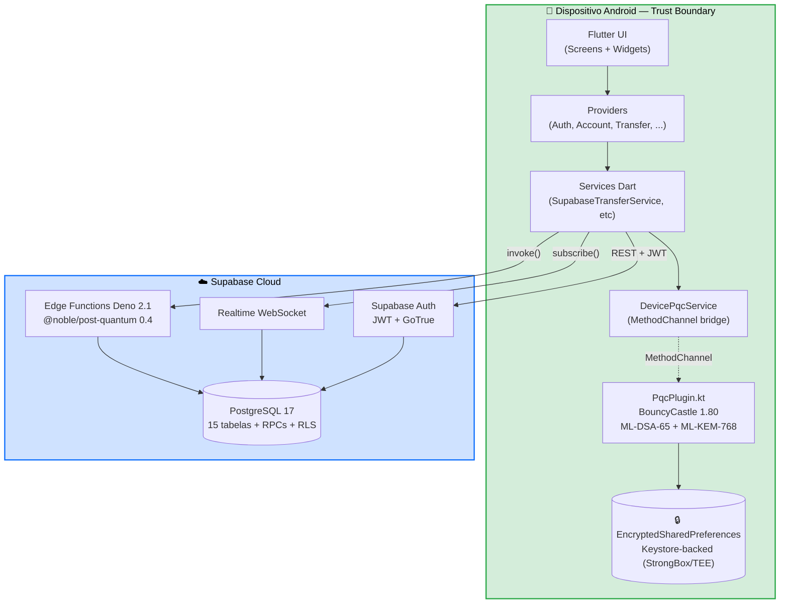
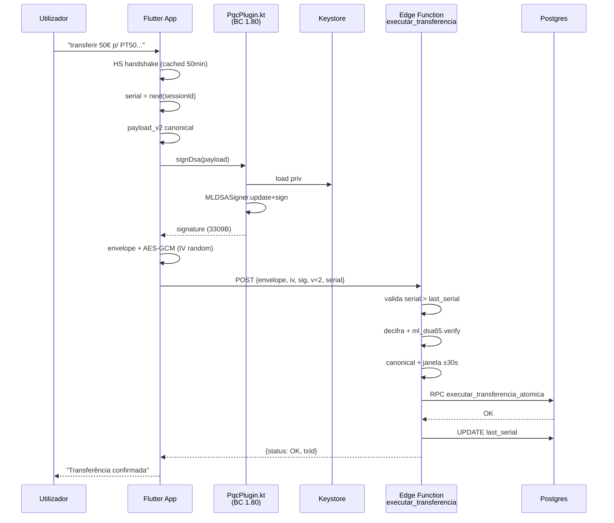

# BJBank — Banca Móvel Pós-Quântica

[](https://docs.flutter.dev)
[](https://dart.dev)
[](https://supabase.com)
[](https://csrc.nist.gov/projects/post-quantum-cryptography)
[]()

<div align="center">

**Banca móvel pós-quântica · Tese de Mestrado · Instituto Politécnico da Guarda · 2026**

Autor: **Vagner Bom Jesus** · Orientador: **Prof. Rui A. P. Perdigão**

</div>

---

## Sumário

- [Visão geral](#visão-geral)
- [Quick Start](#quick-start)
- [Arquitectura](#arquitectura)
- [Stack técnico](#stack-técnico)
- [Pipeline pós-quântico](#pipeline-pós-quântico-end-to-end)
- [Funcionalidades implementadas](#funcionalidades-implementadas)
- [Estrutura do projecto](#estrutura-do-projecto)
- [Backend Supabase](#backend-supabase)
- [Setup local](#setup-local)
- [Benchmarks PQC](#benchmarks-pqc)
- [Documentação](#documentação)
- [Estado actual e o que falta](#estado-actual-e-o-que-falta)
- [Contribuir](#contribuir)
- [Licença](#licença)

---

## Quick Start

### Correr a app em 3 passos:

```bash
# 1. Clonar e instalar
git clone https://github.com/VagnerBomJesus/BJBank.git
cd bjbank && flutter pub get

# 2. Escolher plataforma
flutter run -d android    # Android emulator
flutter run -d iphone     # iOS simulator

# 3. Testar funcionalidades
# Login com email/password
# Criar transferência → visualizar pipeline PQC
# Settings → Segurança → Benchmark PQC (servidor)
```

**Credenciais de teste**:
- Email: `test@example.com`
- Password: `Test123!@#`
- (Ou criar nova conta)

### Recursos importantes:

| Recurso | Link |
|---|---|
| **Como contribuir** | [`CONTRIBUTING.md`](CONTRIBUTING.md) — setup dev, padrões, checklist |
| **Arquitectura técnica** | [`docs/ARCHITECTURE.md`](docs/ARCHITECTURE.md) — camadas, fluxos, diagramas |
| **Requisitos funcionais e não funcionais** | [`docs/REQUIREMENTS.md`](docs/REQUIREMENTS.md) — RF-01 a RF-60 + RNF-01 a RNF-59 + estado de implementação |
| **Diagramas UML (Mermaid)** | [`docs/UML_DIAGRAMS.md`](docs/UML_DIAGRAMS.md) — 14 diagramas (componentes, sequência, estado, classes, ER, atividade) |
| **Diagramas drawio (editáveis)** | [`docs/diagrams/BJBank_Architecture.drawio`](docs/diagrams/BJBank_Architecture.drawio) — 9 páginas com stack, sequências, ER, deployment, comparativo PFS |
| **Estratégia de segurança** | [`docs/adr/ADR-003-SECURITY-STRATEGY.md`](docs/adr/ADR-003-SECURITY-STRATEGY.md) — modelo de ameaça, mitigações, pipeline wire v2 |
| **PQC on-device — plano** | [`docs/PQC_ON_DEVICE_MIGRATION.md`](docs/PQC_ON_DEVICE_MIGRATION.md) — Fases 0 a 5 |
| **PQC — problemas críticos restantes** | [`docs/PQC_REMAINING_CRITICAL_ISSUES.md`](docs/PQC_REMAINING_CRITICAL_ISSUES.md) — estado e resolução dos 3 problemas |
| **Prontidão para defesa de tese** | [`docs/THESIS_READINESS.md`](docs/THESIS_READINESS.md) — checklist, gaps bloqueantes, antecipação de perguntas do júri |
| **Trabalhos futuros** | [`docs/FUTURE_WORK.md`](docs/FUTURE_WORK.md) — iOS Swift, ARM real, side-channel, paper follow-up |
| **Deployment** | [`docs/DEPLOYMENT.md`](docs/DEPLOYMENT.md) — Supabase, Edge Functions, secrets |
| **Play Console — correção rejeição** | [`docs/PLAY_CONSOLE_FIX_PLAN.md`](docs/PLAY_CONSOLE_FIX_PLAN.md) |
| **Changelog** | [`CHANGELOG.md`](CHANGELOG.md) — v1.0 → v1.4.0 |
| **Issues & Bugs** | [GitHub Issues](https://github.com/VagnerBomJesus/BJBank/issues) |

---

## Visão geral

**BJBank** é uma aplicação bancária móvel **em Flutter** que implementa **Criptografia Pós-Quântica (PQC) em operações financeiras** reais. Investiga a viabilidade do uso de algoritmos NIST-padronizados (FIPS 203 ML-KEM, FIPS 204 ML-DSA) face ao cenário *Harvest Now, Decrypt Later* (Y2Q).

### O que torna esta aplicação diferente:

| Aspecto | Implementação |
|---|---|
| **PQC end-to-end** | Handshake ML-DSA-65 + ML-KEM-768 + AES-256-GCM + TOFU pinning |
| **Server-side PQC** | Edge Functions Deno com `@noble/post-quantum 0.4` |
| **Client-side simétrica** | HKDF-SHA-256 + AES-256-GCM via `pointycastle` |
| **Transações atómicas** | RPC Postgres com `SELECT FOR UPDATE` e RLS |
| **Realtime** | WebSocket Supabase para saldos + histórico ao vivo |
| **Auditoria PQC** | Assinatura ML-DSA persistida em cada transação |

### Stack resumido:
- **Frontend**: Flutter 3.8 + Dart 3.8 + Provider
- **Backend**: Supabase (Auth, Postgres 15, Realtime, Edge Functions)
- **Cripto**: `@noble/post-quantum` (servidor) + `pointycastle` (cliente)
- **Deployment**: Deno 2.1 (V8 11.6) em Edge Functions

Arquitetura documentada em [`CONTRIBUTING.md`](CONTRIBUTING.md) · Decisões técnicas em [`docs/adr/`](docs/adr).

---

## Arquitectura

Diagrama de componentes (v1.4.0 — plugin nativo Android + benchmark fair-runtime):



**Detalhe completo + 12 diagramas UML** (sequência, estado, classes, ER, atividade): [`docs/UML_DIAGRAMS.md`](docs/UML_DIAGRAMS.md). Arquitectura textual em [`docs/ARCHITECTURE.md`](docs/ARCHITECTURE.md).

---

## Stack técnico

### Cliente Flutter

| Componente | Tecnologia | Responsabilidade |
|---|---|---|
| **Framework** | Flutter 3.8.1 + Dart 3.8.1 | UI, widgets, navegação |
| **State Mgmt** | provider 6.1+ | ChangeNotifier + ChangeNotifierProxyProvider |
| **Backend SDK** | supabase_flutter 2.5+ | Auth, Realtime, RPC calls |
| **Cripto simétrica** | pointycastle 3.9 | HKDF-SHA-256, AES-256-GCM, MAC |
| **Plugins** | app_links, image_picker, share_plus | Deep links, media, sharing |
| **Persistência** | SharedPreferences | TOFU pinning servidor, preferences |

### Backend Supabase + Deno

| Componente | Tecnologia | Responsabilidade |
|---|---|---|
| **Autenticação** | GoTrue (Supabase Auth) | JWT, email/password, session |
| **Banco de dados** | PostgreSQL 15 | 15 tabelas com RLS |
| **Subscrições** | Supabase Realtime (WebSocket) | Saldos + histórico ao vivo |
| **Cripto PQC** | @noble/post-quantum 0.4 | ML-KEM-768, ML-DSA-65 (server-side) |
| **Runtime** | Deno 2.1 / V8 11.6 | Executa 8 Edge Functions |

### 8 Edge Functions em `functions/src/index.ts`

| Função | Propósito | Utiliza |
|---|---|---|
| `pqc_bootstrap` | Entrega chave pública servidor | ML-DSA-65 pub key |
| `pqc_handshake_flutter` | Handshake PQC | ML-KEM-768 encapsulation |
| `flutter_sign_transfer` | Assina payload | ML-DSA-65 signing |
| `verify_dsa` | Verifica assinatura | ML-DSA-65 verify |
| `executar_transferencia` | RPC atómica + decifra | AES-256-GCM decrypt |
| `bench_server_pqc` | Benchmark real | @noble/post-quantum |
| `send_otp_email` | OTP por email | Resend API |
| `lookup_*` | RPCs públicas | PostgreSQL SELECT |

**Nota v1.4.0**: A decisão original (PQC server-only) foi parcialmente revertida. Em Android, ML-DSA-65, ML-KEM-768, SLH-DSA-SHAKE-128f e X25519 correm **no dispositivo** via `PqcPlugin.kt` (BouncyCastle 1.80). Desde v1.4.0 o plugin também mede ECDSA-P256/ECDH-P256 em BC nativo para comparação fair-runtime na tese. iOS continua server-managed até existir plugin Swift análogo. Ver [`ADR-001`](docs/adr/ADR-001-PQC-IMPLEMENTATION.md) §7 e [`docs/PQC_REMAINING_CRITICAL_ISSUES.md`](docs/PQC_REMAINING_CRITICAL_ISSUES.md).

---

## Pipeline pós-quântico end-to-end

Sequência simplificada (Android — assinatura local):



Detalhe técnico passo-a-passo:

1. **Lookup do destinatário** — `RPC lookup_account_by_iban` (`SECURITY DEFINER` contorna RLS para devolver só `account_id`, `user_id`, `iban`, `owner_name`)
2. **Handshake**
   - Cliente gera nonce 32 B aleatórios e POST `pqc_handshake_flutter`
   - Servidor gera `shared_secret` 32 B, assina `(nonce | shared_secret | server_dsa_pub | sessionId)` com ML-DSA-65, persiste em `sessions`
   - Cliente verifica assinatura via `verify_dsa` e faz pin da chave pública do servidor (TOFU)
   - HKDF-SHA-256 deriva 44 bytes → AES key (32 B) + nonceBase (12 B)
3. **Construção do payload canónico** — bytes determinísticos compatíveis com o transcript canónico do servidor:
   ```
   [4B|txId] [4B|origem_iban] [4B|destino_iban] [4B|montante] [4B|descricao] [8B timestamp_be] [4B|nonce16]
   ```
4. **Assinatura ML-DSA-65** — delegada à Edge Function `flutter_sign_transfer` (chave server-managed em `flutter_client_keys`)
5. **Envelope cifrado**
   - Envelope = `[4B|payload][4B|signature]`
   - Cifra AES-256-GCM com IV = `nonceBase ⊕ txId`, AAD = `sessionId`
6. **POST `executar_transferencia`**
   - Decifra (AAD obrigatório)
   - `ml_dsa65.verify(clientDsaPublic, payload, signature)`
   - Reconstrói transcript canónico e compara byte-a-byte
   - Pina `clientDsaPublic` na primeira vez; rejeita se mudar (TOFU)
7. **RPC atómica `executar_transferencia_atomica`**
   - `SELECT FOR UPDATE` em conta origem e destino
   - Valida saldo e ownership
   - `UPDATE` saldos
   - `INSERT` em `transactions`: linha negativa na origem, positiva no destino
   - Tudo numa única transacção SQL

Diagrama detalhado: `MCiber/diagramas/06_seq_transferencia_iban.drawio`.

---

## Funcionalidades implementadas

### Autenticação
- Registo com email/password/nome/telefone (+351 obrigatório)
- Login com JWT
- Recuperação de palavra-passe via deep link `bjbank://reset`
- Alteração de palavra-passe (re-auth com password actual)
- Logout
- Eliminar conta (cascade RLS)

### Perfil
- Editar nome e telefone (validador +351 com formato 9 dígitos)
- Carregar foto de perfil (camara/galeria, redimensionada 512×512, base64 em `users.photo_url`)
- Refresh automático após edição

### Conta bancária
- IBAN PT gerado automaticamente no signup (trigger `handle_new_user`)
- Saldo em EUR
- Vista pelo dashboard com Realtime

### Transferências
- **Por IBAN** com validação MOD 97
- **Por MBWay** (telefone → IBAN via `mbway_phones`)
- Confirmação em ecrã separado
- Recibo com badge PQC após sucesso
- Histórico actualizado em tempo real

### MBWay
- Activar com número (auto-formatação +351 9XX XXX XXX)
- 1 número por conta (constraint `UNIQUE(account_id)`)
- Desactivar
- Configurar limites diário e por transacção
- Auto-link em `mbway_phones` se telefone fornecido no signup

### Histórico
- Lista com Realtime
- Filtros: Todas, Receitas, Despesas, Transferências, MBWay
- Pesquisa por descrição/categoria
- Agrupamento por data (Hoje, Ontem, Esta Semana, Este Mês, MM/AAAA)
- Modal de detalhe com badge PQC

### Cartões
- Visualizar cartões associados
- Toggle de definições (contactless, online, internacional)
- Editar limites diário/mensal

### Segurança / PQC
- Benchmark PQC local (Dilithium2/3/5 + Kyber512/768/1024)
- Benchmark PQC servidor (primitivas reais `@noble/post-quantum`)
- Export JSON / Markdown dos resultados
- Página "Sobre" actualizada com stack técnico completo

---

## Estrutura do projecto

```
bjbank/
├─ lib/
│  ├─ main.dart                              # entry point + Supabase init + Deep Links
│  ├─ app.dart                               # MultiProvider + MaterialApp
│  ├─ models/                                # UserModel, AccountModel, TransactionModel, …
│  ├─ providers/                             # AuthProvider, AccountProvider, TransferProvider, …
│  ├─ routes/                                # AppRouter, AppRoutes
│  ├─ services/
│  │  ├─ supabase_config.dart                # URL + anon key
│  │  ├─ supabase_auth_service.dart          # signIn/signUp/updatePassword/deleteAccount
│  │  ├─ supabase_account_service.dart       # streams accounts/transactions via Realtime
│  │  ├─ supabase_transfer_service.dart      # PIPELINE PQC end-to-end (orquestra handshake+sign+cipher)
│  │  ├─ supabase_pqc_handshake_service.dart # nonce + shared_secret + HKDF-SHA256
│  │  ├─ supabase_mbway_service.dart         # lookup phone, ativar MBWay, pagar
│  │  ├─ trusted_server_key_service.dart     # TOFU pinning persistente via SharedPreferences
│  │  ├─ server_pqc_benchmark_service.dart   # invoca bench_server_pqc Edge Function
│  │  ├─ pqc_service.dart                    # local PoC (benchmark simulado)
│  │  ├─ deep_link_handler.dart              # bjbank://reset, bjbank://login
│  │  ├─ firebase_config.dart                # config legacy (compat)
│  │  ├─ firestore_service.dart              # adapter legacy para Supabase
│  │  └─ [outros serviços]                   # notification, otp, seed_data, …
│  ├─ compat/                                # Compatibility layer Firebase→Supabase
│  │  ├─ firebase_auth_compat.dart
│  │  ├─ firebase_core_compat.dart
│  │  ├─ firebase_messaging_compat.dart
│  │  └─ firestore_compat.dart
│  ├─ screens/
│  │  ├─ auth/                               # login, register, seed, forgot_password
│  │  ├─ home/                               # dashboard + quick actions
│  │  ├─ transfer/                           # transfer_screen, mbway_screen, confirmação, recibo
│  │  ├─ history/                            # history_screen com filtros + pesquisa
│  │  ├─ cards/                              # cards_screen + card_settings_dialog
│  │  ├─ profile/                            # profile_screen com avatar + telefone
│  │  ├─ settings/                           # mbway_settings, mbway_phone_verification, about
│  │  ├─ security/                           # pqc_benchmark_screen (local + server)
│  │  └─ splash/                             # splash_screen (session handling)
│  └─ theme/                                 # colors, spacing, typography, app_strings
├─ assets/
│  ├─ logo_bjbank.png
│  └─ mbway.png                              # logo oficial MB WAY
├─ docs/
│  ├─ ARCHITECTURE.md                        # detalhada da arquitetura completa
│  ├─ DEPLOYMENT.md                          # setup Supabase, Edge Functions, secrets
│  ├─ FIREBASE-BEST-PRACTICES.md             # referência (Firebase legacy)
│  ├─ FIREBASE_EMAIL_SETUP.md                # configuração de email
│  ├─ adr/
│  │  ├─ ADR-001-PQC-IMPLEMENTATION.md       # decisão de cripto server-side
│  │  ├─ ADR-002-STATE-MANAGEMENT.md         # Provider + Realtime
│  │  └─ ADR-003-SECURITY-STRATEGY.md        # ameaças, modelo RLS
│  └─ [diagramas UML em docs-site/]
├─ docs-site/                                # Website de documentação (Next.js)
│  ├─ src/app/
│  ├─ src/components/
│  └─ [configuração Next.js + Tailwind]
├─ functions/                                # Supabase Edge Functions (Deno 2.1)
│  ├─ src/index.ts                          # 8 funções PQC + transferências
│  └─ [package.json, tsconfig.json]
├─ android/                                  # Android manifest + plugins
├─ ios/                                      # iOS configuration
├─ CHANGELOG.md                              # v1.1.0 com detalhes da migração
├─ CONTRIBUTING.md                           # guidelines de contribuição
├─ pubspec.yaml                              # dependências (supabase_flutter, crypto, etc.)
├─ pubspec.lock
└─ README.md (este ficheiro)
```

---

## Backend Supabase

**Project URL**: `https://jdybjrpmybkmmfdlwrzp.supabase.co`

### Serviços de Backend Implementados

| Serviço | Localização | Responsabilidade |
|---|---|---|
| **SupabaseAuthService** | `lib/services/supabase_auth_service.dart` | Registo, login, reset password, alteração password, delete account |
| **SupabaseAccountService** | `lib/services/supabase_account_service.dart` | Streams Realtime de `accounts` e `transactions` |
| **SupabaseTransferService** | `lib/services/supabase_transfer_service.dart` | **Orquestra pipeline PQC end-to-end** (handshake → sign → cipher → RPC) |
| **SupabasePqcHandshakeService** | `lib/services/supabase_pqc_handshake_service.dart` | Nonce + shared_secret + HKDF-SHA-256 derivation |
| **TrustedServerKeyService** | `lib/services/trusted_server_key_service.dart` | TOFU pinning persistente de chave pública servidor |
| **SupabaseMbwayService** | `lib/services/supabase_mbway_service.dart` | Lookup phone, ativar MBWay, pagar via MBWay |
| **ServerPqcBenchmarkService** | `lib/services/server_pqc_benchmark_service.dart` | Invoca `bench_server_pqc` Edge Function |

### Tabelas (15, todas com RLS)

| Tabela | Propósito |
|---|---|
| `users` | Perfis (id, email, nome, phone, photo_url, pqc_public_key_base64) |
| `accounts` | Contas bancárias (IBAN, saldo, tipo) |
| `transactions` | Movimentos com assinatura ML-DSA persistida |
| `sessions` | Sessões PQC (shared_secret + expires_at) |
| `mbway_phones` | Mapping phone → account (UNIQUE account_id) |
| `mbway_contacts` | Contactos recentes MBWay |
| `cards` | Cartões com limites |
| `flutter_client_keys` | Chaves ML-DSA do cliente Flutter (server-managed) |
| `public_config` | Chaves ML-DSA do servidor |
| `bills`, `loans`, `investments`, `savings_goals`, `budgets`, `notification_preferences` | Reservadas para futuro |

### RPCs públicas (`SECURITY DEFINER`)

- `lookup_account_by_iban(p_iban)` — devolve só id/user_id/iban/owner_name
- `lookup_account_by_phone(p_phone)` — JOIN mbway_phones + accounts + users
- `lookup_user_public(p_user_id)` — id, nome, photo_url
- `executar_transferencia_atomica(...)` — debit+credit numa transacção
- `bjbank_gerar_iban_pt()` — IBAN PT50 com check digits

### Política RLS (resumida)

- `accounts`: SELECT só do dono (`user_id = auth.uid()`); WRITE só `service_role`
- `transactions`: SELECT só de contas próprias; WRITE só `service_role` (via Edge Function)
- `mbway_phones`: SELECT a qualquer autenticado (para lookup); INSERT/DELETE só do próprio
- `users`: SELECT/UPDATE só do próprio
- Operações destrutivas em massa → SQL Editor do Supabase Dashboard com service_role

---

## Setup local

### Pré-requisitos

- Flutter 3.8+ (`flutter doctor`)
- Android Studio ou Xcode (para correr em dispositivo)
- Conta Supabase com o projecto BJBank acessível (URL + anon key estão hardcoded em `lib/services/supabase_config.dart` para conveniência académica — para produção, mover para `--dart-define`)

### Instalação

```bash
git clone https://github.com/VagnerBomJesus/BJBank.git
cd bjbank
flutter pub get
flutter run
```

Para emulador Android com problemas DNS: ver `docs/DEPLOYMENT.md`.

### Deep links

Configurados em `android/app/src/main/AndroidManifest.xml`:
- `bjbank://reset` — reset de password
- `bjbank://login` — link directo de login

---

## Benchmarks PQC

A app inclui ecrã de benchmark (`Settings → Segurança → Benchmark PQC`) com duas modalidades:

**Local (PoC)**: Mede serialização + I/O do cliente Flutter (modo simulação, primitivas mockadas). Útil para discutir overhead arquitectural.

**Servidor (real)**: Invoca `bench_server_pqc` Edge Function que mede `@noble/post-quantum` real. Configurável (10-100 iterações × 6 algoritmos). Exporta JSON ou Markdown.

**Resultados representativos** (Deno 2.1 / V8 11.6, N=50):

| Algoritmo | Op | Mean | P50 | P95 |
|---|---|---|---|---|
| ML-KEM-768 | keygen | 0.53 ms | 0.41 ms | 0.53 ms |
| ML-KEM-768 | encaps | 0.53 ms | 0.47 ms | 0.66 ms |
| ML-KEM-768 | decaps | 0.55 ms | 0.51 ms | 0.72 ms |
| ML-DSA-65 | keygen | 4.08 ms | 3.63 ms | 4.18 ms |
| ML-DSA-65 | sign | 12.64 ms | 10.37 ms | 27.01 ms |
| ML-DSA-65 | verify | 4.43 ms | 3.62 ms | 3.97 ms |

Comparação com clássico (SUPERCOP @ Intel i7-6500U):
- **ECDSA-P256 sign 0.24 ms vs ML-DSA-65 sign 12.6 ms** → overhead ~52×
- **X25519 ECDH 0.06 ms vs ML-KEM-768 encaps 0.53 ms** → overhead ~9×

---

## Documentação

| Documento | Conteúdo |
|---|---|
| [`docs/ARCHITECTURE.md`](docs/ARCHITECTURE.md) | Arquitectura end-to-end (Flutter ↔ Supabase ↔ Edge Functions) |
| [`docs/DEPLOYMENT.md`](docs/DEPLOYMENT.md) | Setup Supabase, deploy Edge Functions, configuração secrets |
| [`docs/FIREBASE-BEST-PRACTICES.md`](docs/FIREBASE-BEST-PRACTICES.md) | Referência de boas práticas Firebase (legacy) |
| [`docs/FIREBASE_EMAIL_SETUP.md`](docs/FIREBASE_EMAIL_SETUP.md) | Configuração de email via Firebase/Resend |
| [`docs/adr/ADR-001-PQC-IMPLEMENTATION.md`](docs/adr/ADR-001-PQC-IMPLEMENTATION.md) | **Decisão arquitectural**: cripto ML-DSA/ML-KEM server-side em Deno, simetria (HKDF/AES-256-GCM) client-side |
| [`docs/adr/ADR-002-STATE-MANAGEMENT.md`](docs/adr/ADR-002-STATE-MANAGEMENT.md) | State management com Provider + Realtime WebSocket |
| [`docs/adr/ADR-003-SECURITY-STRATEGY.md`](docs/adr/ADR-003-SECURITY-STRATEGY.md) | Modelo de ameaças, Row-Level Security, TOFU pinning, Y2Q |
| [`CHANGELOG.md`](CHANGELOG.md) | Histórico v1.0→v1.1.0 com detalhe completo da migração |
| [`EMAIL_OTP_IMPLEMENTATION.md`](EMAIL_OTP_IMPLEMENTATION.md) | Guia implementação OTP por email |
| [`docs-site/`](docs-site/) | Website de documentação interativa (Next.js 14 + Tailwind) |

---

## Estado actual e o que falta

### ✅ v1.4.0 — Benchmark fair-runtime + versionamento centralizado

- `PqcPlugin.kt`: novo `classicBenchmark` mede ECDSA-P256/ECDH-P256 em BC 1.80 nativo. Comparação algoritmo-vs-algoritmo na mesma runtime.
- `DeviceBenchmarkScreen` corre 3 pipelines (PQC nativo, Clássico nativo, Clássico Dart) + card de ratios automáticos.
- `lib/app_version.dart` como single source of truth. Corrige bugs visuais "1.0.0" (settings) e "1.1.0 / BC 1.82" (about).

### ✅ v1.3.x — Material académico + endurecimento Android

- v1.3.1: ProGuard/R8, NetworkSecurityConfig, serial persistido, DataExtractionRules, cleanup 10 serviços legacy.
- v1.3.0: PFS pós-quântico real, audit log hash-chained, rotação chaves servidor, SLH-DSA-SHAKE-128f, Hybrid X25519+ML-KEM.

### ✅ v1.2.0 — PQC on-device Android + endurecimento criptográfico

**Cripto pós-quântica on-device (Android)**
- ✅ Plugin nativo Kotlin `PqcPlugin.kt` com BouncyCastle 1.80 (ML-DSA-65 FIPS 204 + ML-KEM-768 FIPS 203)
- ✅ Chave privada ML-DSA do utilizador no Keystore-backed `EncryptedSharedPreferences` — **nunca sai do dispositivo**
- ✅ Assinatura ML-DSA local em transferências (`SupabaseTransferService._assinarPayload`)
- ✅ Verificação ML-DSA local no handshake (fim do trust circular `verify_dsa`)
- ✅ Auto-onboarding: gera par + regista via RPC `register_client_pubkey` no primeiro login/signup
- ✅ Migração transparente para utilizadores legados (chave server-managed antiga é revogada implicitamente)

**Endurecimento do protocolo de transferência (wire v2)**
- ✅ `Random.secure()` (CSPRNG do SO) em vez de Fortuna mal semeado
- ✅ IV do AES-GCM 12 B random por mensagem (eliminado XOR `nonceBase ⊕ txId` que se reusava em retries)
- ✅ Janela temporal de replay ±30 s na RPC `executar_transferencia_atomica`
- ✅ Serial monotónico por sessão (`sessions.last_serial`, protocolo wire v2)
- ✅ First-use pubkey injection bloqueada (recusa 412 se pubkey não registada)
- ✅ TTL local de sessão (50 min) com auto-renovação antes do servidor a expirar
- ✅ Normalização de IBAN/descrição no payload canónico

**IBAN PT válido**
- ✅ Check NIB calculado pelo algoritmo Banco de Portugal (pesos `73,17,89,38,62,45,53,15,50,5,49,34,81,76,27,90,9,30,3`)
- ✅ Todos os IBANs gerados começam por `PT50` (matemática garantida)

**Backend e frontend (mantido da v1.1.0)**
- ✅ Supabase project deployado em `jdybjrpmybkmmfdlwrzp.supabase.co`
- ✅ 15 tabelas Postgres com RLS + RPCs `SECURITY DEFINER`
- ✅ 8 Edge Functions Deno + `@noble/post-quantum 0.4`
- ✅ Auth + Perfil + Transferências + MBWay + Histórico Realtime + Cards UI
- ✅ Benchmark PQC servidor com primitivas reais
- ✅ Deep links + Compatibility layer

### ⚠️ Parcialmente implementado
- **iOS**: cripto PQC ainda server-managed (falta `PqcPlugin.swift` com libsodium ou Swift CryptoKit). Fallback automático para Edge Function `flutter_sign_transfer`.
- ~~**PFS no handshake**~~ → ✅ **Resolvido em v1.3.0**. `pqc_handshake_flutter` v2 + `pqc_handshake_kem_complete` + `kemEncapsulate` local. `sharedSecret` nunca atravessa a rede em claro. HNDL deixa de ser aplicável no Android.
- QR Code (telas existem mas botão da home mostra "Em breve")
- Cards (UI funcional mas dados ainda são shim)

### 📚 Para a parte académica da tese
- [ ] Pipeline clássico paralelo (ECDH-P256 + ECDSA-P256) para benchmark PQC vs Clássico
- [ ] Recolha de dados experimentais com N=200+ iterações para confiança estatística
- [ ] Análise de overhead temporal Android nativo (PqcPlugin) vs server-side
- [ ] Plugin Swift análogo para iOS
- [ ] Refactor handshake para PFS real (cliente faz `kemEncapsulate` em vez de receber `sharedSecret`)

### 🧹 Limpeza técnica sugerida
- Ficheiros legacy com dados obsoletos (ainda funcionam via shim):
  - `lib/services/bill_service.dart`, `budget_service.dart`, `investment_service.dart`, `loan_service.dart`, `savings_goal_service.dart`
  - `lib/providers/bill_provider.dart`, etc.
- Edge Functions `flutter_sign_transfer` e `verify_dsa` ficam obsoletas quando iOS migrar — manter durante 1 release pós-migração.

---

## Contribuir

Este é um projecto académico aberto a contribuições em pesquisa, *bug fixes*, e extensões educacionais.

### Contribuições apropriadas:
- ✅ Bug reports (com stack trace, passos para reproduzir)
- ✅ Segurança disclosures (contactar `vagneripg@gmail.com` com `[SECURITY]` em assunto)
- ✅ Melhorias em documentação
- ✅ Investigação em PQC (novos algoritmos, benchmarks, análise)
- ✅ Testes e cobertura
- ✅ Refactoring com padrões estabelecidos

### Workflow:
1. Ler [`CONTRIBUTING.md`](CONTRIBUTING.md) completamente
2. Criar branch `feat/`, `fix/`, `docs/`, etc.
3. Implementar com padrões do projecto (singletons, imutabilidade, RLS)
4. Passar `flutter analyze` (sem warnings)
5. Submeter PR com descrição clara

### Perguntas frequentes:

**P: Posso usar esta app em produção?**
R: Não. É investigação académica. Uso comercial requer autorização explícita. Ver licença.

**P: Por que server-side PQC em vez de cliente?**
R: Ausência de bibliotecas Dart fiáveis para ML-DSA-65. Documentado em [`ADR-001`](docs/adr/ADR-001-PQC-IMPLEMENTATION.md).

**P: Como está o suporte a Y2Q?**
R: ML-DSA-65 + ML-KEM-768 são resistentes a quantum. Assinatura persistida em cada transação. Ver [`ADR-003`](docs/adr/ADR-003-SECURITY-STRATEGY.md).

**P: Posso fazer benchmark PQC?**
R: Sim. `Settings → Segurança → Benchmark PQC` → local (PoC) ou servidor (real). Exporta JSON/Markdown.

---

## Licença

**Investigação Académica**. Uso comercial requer autorização explícita.

© 2026 Vagner Bom Jesus · Instituto Politécnico da Guarda · Todos os direitos reservados.

Termos completos: [`LICENSE`](LICENSE) (Academic Research License com restrições comerciais).

---

## Contacto & Suporte

| Tipo | Contacto |
|---|---|
| **Issues técnicas** | [GitHub Issues](https://github.com/VagnerBomJesus/BJBank/issues) |
| **Segurança** | `vagneripg@gmail.com` (com `[SECURITY]` em assunto) |
| **Autor** | Vagner Bom Jesus — vagneripg@gmail.com |
| **Orientador** | Prof. Doutor Rui A. P. Perdigão |
| **Instituição** | Instituto Politécnico da Guarda |
| **Backend URL** | `https://jdybjrpmybkmmfdlwrzp.supabase.co` |
| **GitHub** | [VagnerBomJesus/BJBank](https://github.com/VagnerBomJesus/BJBank) |

---

**Obrigado por explorar o futuro da banca móvel pós-quântica.** 🚀
