# BJBank — Diagramas UML

Documento consolidado com todos os diagramas UML do sistema, escritos em **Mermaid** (renderização automática em GitHub, GitLab, IDEs Markdown).

Versão refletida: **v1.2.0** (Junho 2026) — pós-implementação do plugin nativo Android + endurecimento criptográfico.

## Índice

1. [Diagrama de Componentes — Arquitectura geral](#1-diagrama-de-componentes--arquitectura-geral)
2. [Diagrama de Deployment — Distribuição física](#2-diagrama-de-deployment--distribuição-física)
3. [Diagrama de Sequência — Onboarding PQC (login/signup)](#3-diagrama-de-sequência--onboarding-pqc)
4. [Diagrama de Sequência — Transferência segura (protocolo wire v2)](#4-diagrama-de-sequência--transferência-segura)
5. [Diagrama de Sequência — Handshake PQC](#5-diagrama-de-sequência--handshake-pqc)
6. [Diagrama de Estado — Sessão PQC](#6-diagrama-de-estado--sessão-pqc)
7. [Diagrama de Estado — Chave ML-DSA do utilizador](#7-diagrama-de-estado--chave-ml-dsa-do-utilizador)
8. [Diagrama de Classes — Camada de serviços PQC](#8-diagrama-de-classes--camada-de-serviços-pqc)
9. [Diagrama de Classes — Providers (gestão de estado)](#9-diagrama-de-classes--providers)
10. [Diagrama Entidade-Relacionamento — Schema Postgres](#10-diagrama-entidade-relacionamento--schema-postgres)
11. [Diagrama de Fluxo de Dados — Geração de IBAN](#11-diagrama-de-fluxo-de-dados--geração-de-iban)
12. [Diagrama de Atividade — Anti-replay multi-camada](#12-diagrama-de-atividade--anti-replay)
13. [Diagrama de Sequência — Handshake PFS pós-quântico (KEM v2)](#13-diagrama-de-sequência--handshake-pfs-pós-quântico-kem-v2)
14. [Diagrama Comparativo — Modo legacy vs KEM](#14-diagrama-comparativo--modo-legacy-vs-kem)

---

## 1. Diagrama de Componentes — Arquitectura geral

Vista de alto nível: três camadas (Flutter UI, Edge Functions, Postgres) e a trust boundary onde a cripto privada vive.

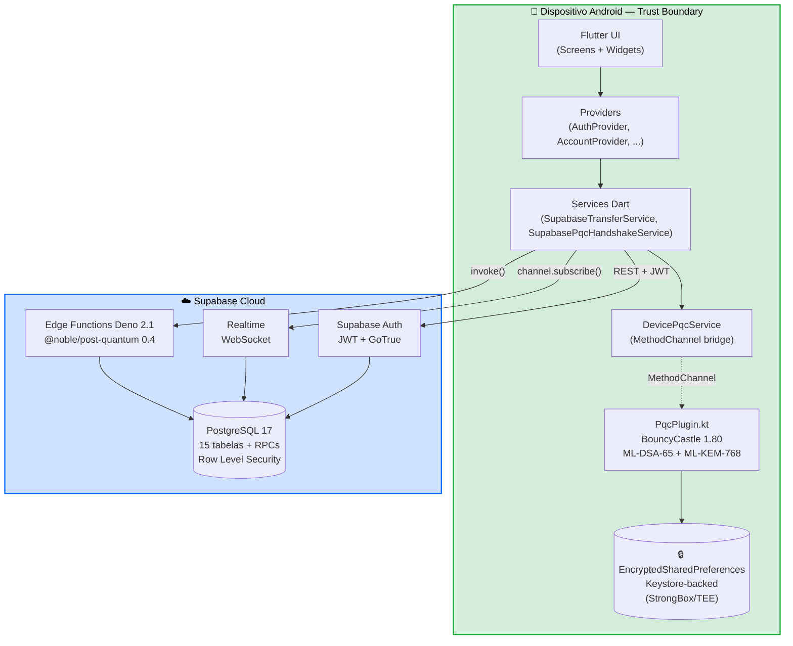

**Pontos críticos:**
- A `Trust Boundary` é o próprio dispositivo Android. Privada ML-DSA do utilizador nunca atravessa esta linha.
- iOS ainda fora desta boundary (privada em `flutter_client_keys.secret_key_base64` no Postgres). Plano: plugin Swift análogo.

---

## 2. Diagrama de Deployment — Distribuição física

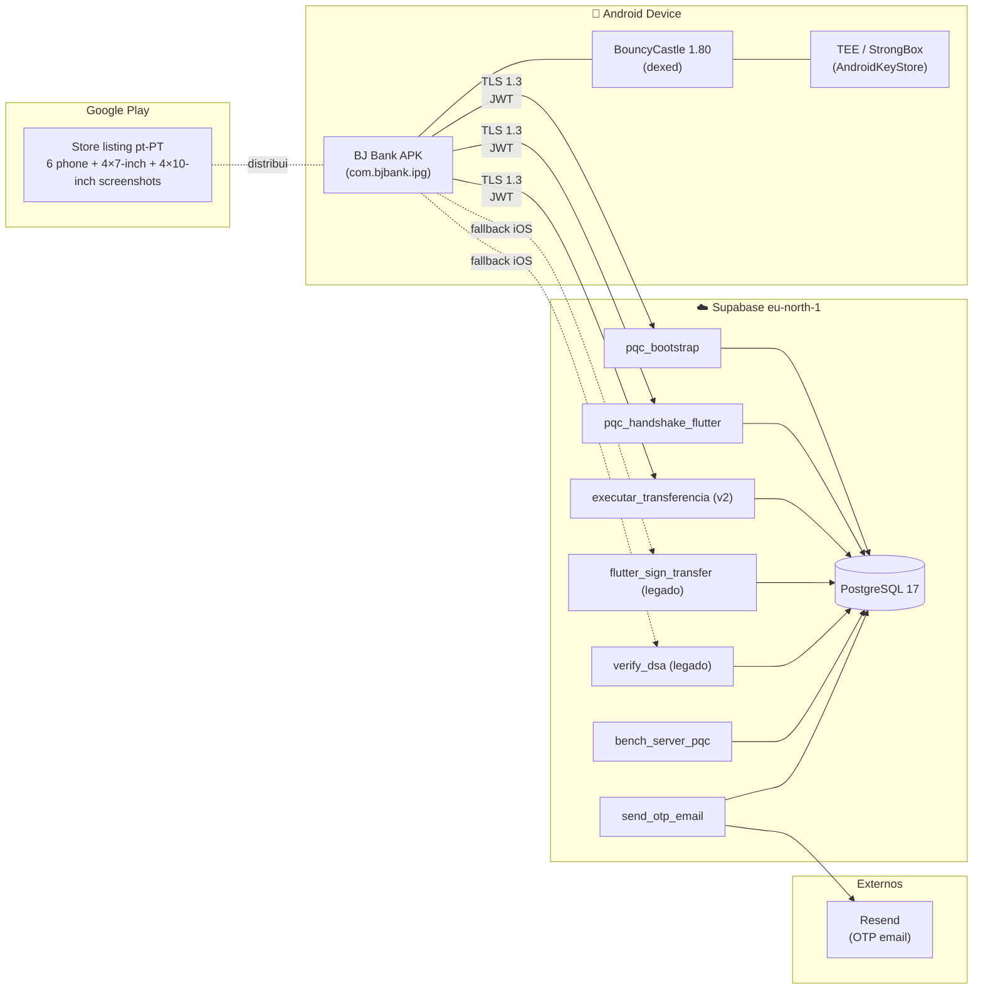

---

## 3. Diagrama de Sequência — Onboarding PQC

Acontece automaticamente após **login** ou **signup** bem sucedidos. Idempotente — pode ser chamado várias vezes sem efeitos.

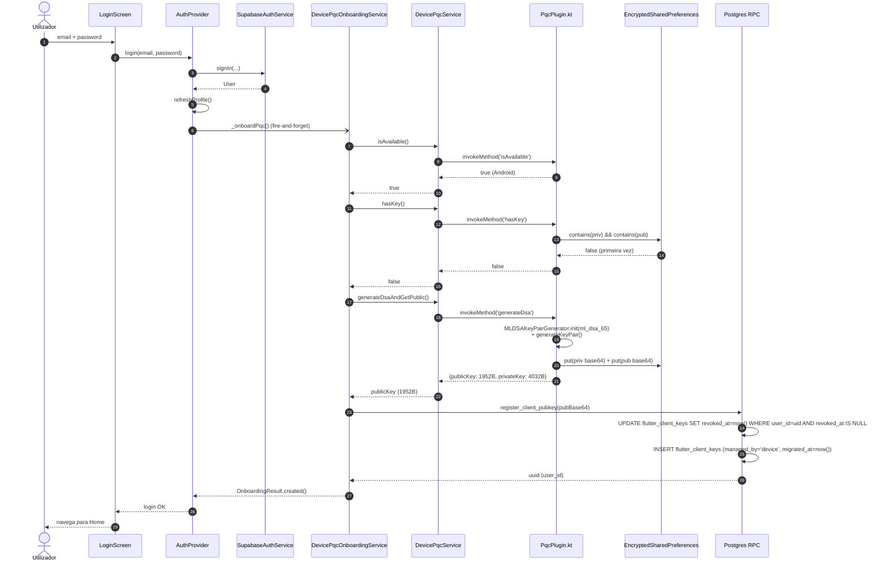

---

## 4. Diagrama de Sequência — Transferência segura

Fluxo completo de transferência com o **protocolo wire v2** (serial monotónico + protocolVersion=2). Privada ML-DSA vive no Keystore — assinatura é local no Android.

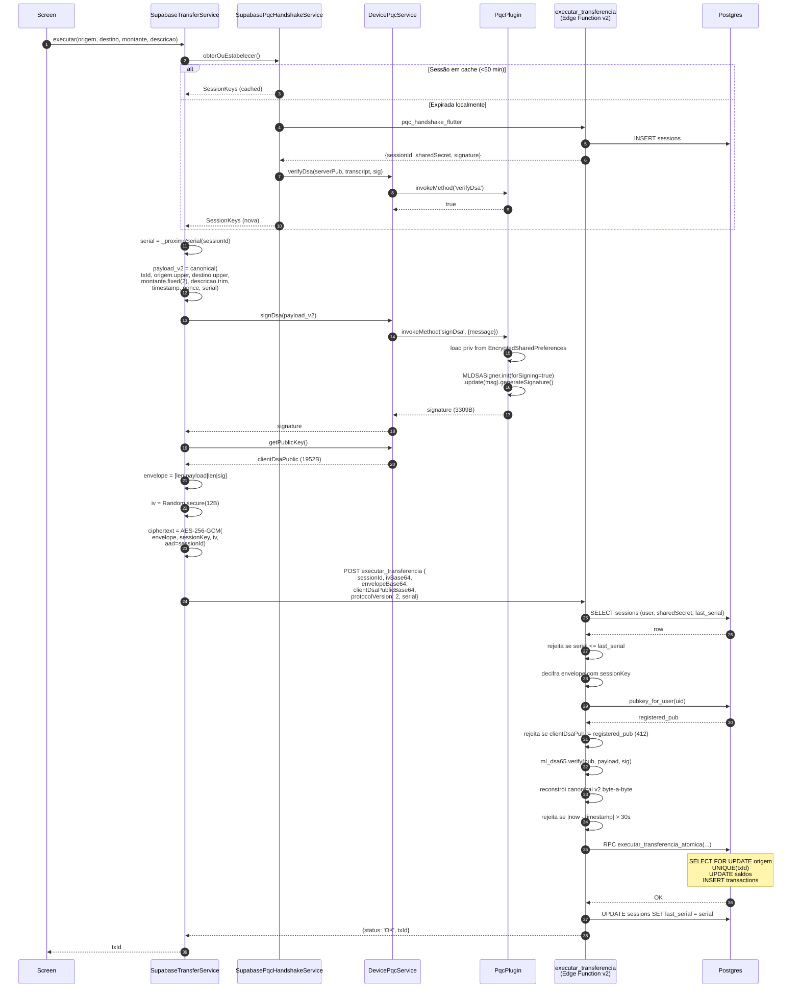

---

## 5. Diagrama de Sequência — Handshake PQC

Detalhe do estabelecimento de sessão. Cliente verifica localmente a assinatura ML-DSA do servidor (sem `verify_dsa` server-side).

```mermaid
sequenceDiagram
    autonumber
    participant HS as SupabasePqcHandshakeService
    participant TS as TrustedServerKeyService<br/>(TOFU pinning)
    participant FN1 as pqc_bootstrap
    participant FN2 as pqc_handshake_flutter
    participant DP as DevicePqcService
    participant Native as PqcPlugin
    participant DB as Postgres

    Note over HS: 1. Bootstrap (1ª vez ou cache miss)
    HS->>TS: temChavePublica()?
    TS-->>HS: false
    HS->>FN1: GET pqc_bootstrap
    FN1->>DB: SELECT public_config WHERE key='server_ml_dsa'
    DB-->>FN1: serverDsaPub
    FN1-->>HS: {serverDsaPublicBase64}
    HS->>TS: setTrustedKey(serverDsaPub)
    TS->>TS: persist em FlutterSecureStorage

    Note over HS: 2. Handshake
    HS->>HS: clientNonce = Random.secure(32B)
    HS->>FN2: POST {clientNonceBase64}
    FN2->>FN2: sharedSecret = randomBytes(32)
    FN2->>FN2: transcript = clientNonce ‖ sharedSecret ‖<br/>serverDsaPub ‖ sessionId
    FN2->>FN2: signature = ml_dsa65.sign(serverPriv, transcript)
    FN2->>DB: INSERT sessions (sharedSecret, expires_at=now+1h)
    FN2-->>HS: {sessionId, sharedSecret, signature, serverDsaPub}

    Note over HS: 3. Pin check + verificação LOCAL (Android)
    HS->>TS: verificar(serverDsaPub)
    TS->>TS: constant-time compare vs pinned
    TS-->>HS: OK (sem mismatch)

    HS->>HS: reconstrói transcript
    HS->>DP: verifyDsa(serverDsaPub, transcript, signature)
    DP->>Native: invokeMethod('verifyDsa')
    Native->>Native: MLDSASigner.init(forSigning=false, pubKeyParams)<br/>.update(transcript).verifySignature(sig)
    Native-->>DP: true
    DP-->>HS: true

    Note over HS: 4. Derivação chave AES
    HS->>HS: derived = HKDF-SHA-256(<br/>sharedSecret, salt=sessionId,<br/>info='BJBank-v1|session-keys', 44B)
    HS->>HS: SessionKeys(<br/>sessionId, aesKey=derived[0:32],<br/>nonceBase=derived[32:44])
    HS->>HS: _cached = session; _cachedAt = now()
```

---

## 6. Diagrama de Estado — Sessão PQC

Estados do singleton `SupabasePqcHandshakeService` em runtime.

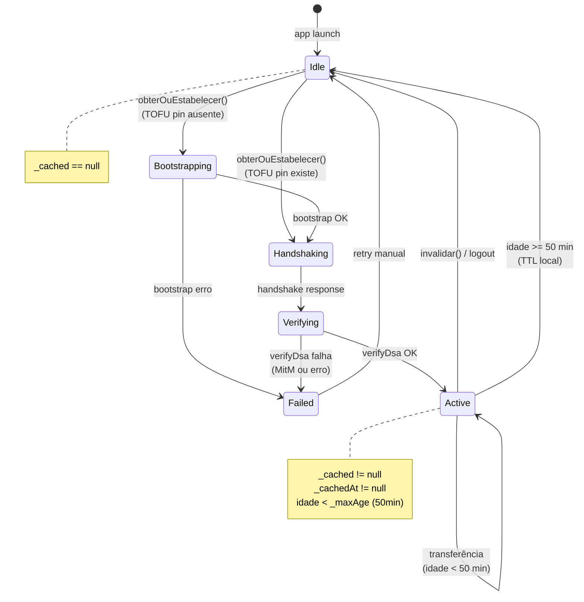

---

## 7. Diagrama de Estado — Chave ML-DSA do utilizador

Ciclo de vida da chave no `flutter_client_keys`, com transições server-managed → device-managed.

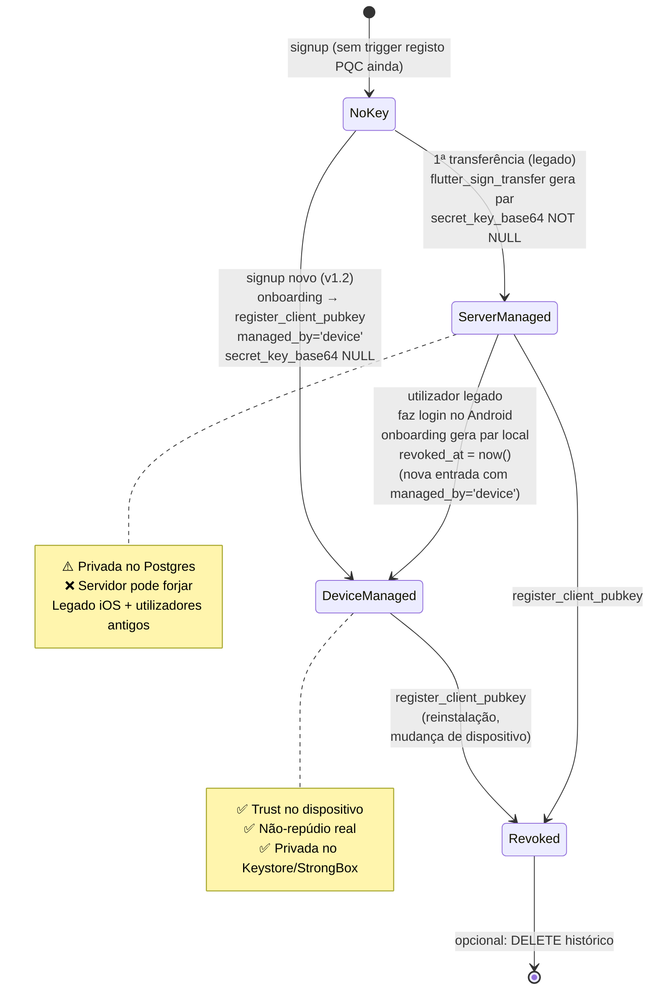

---

## 8. Diagrama de Classes — Camada de serviços PQC

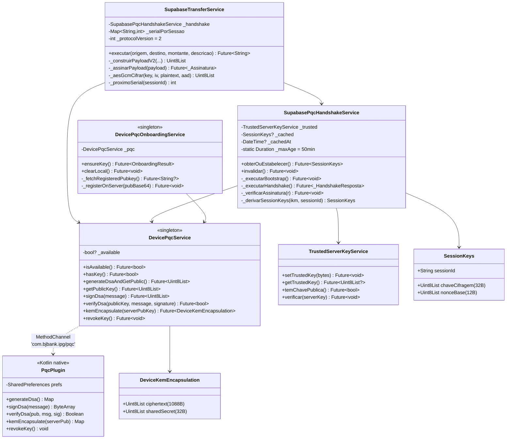

---

## 9. Diagrama de Classes — Providers

Vista da camada `Provider + ChangeNotifier` (ver `ADR-002`).

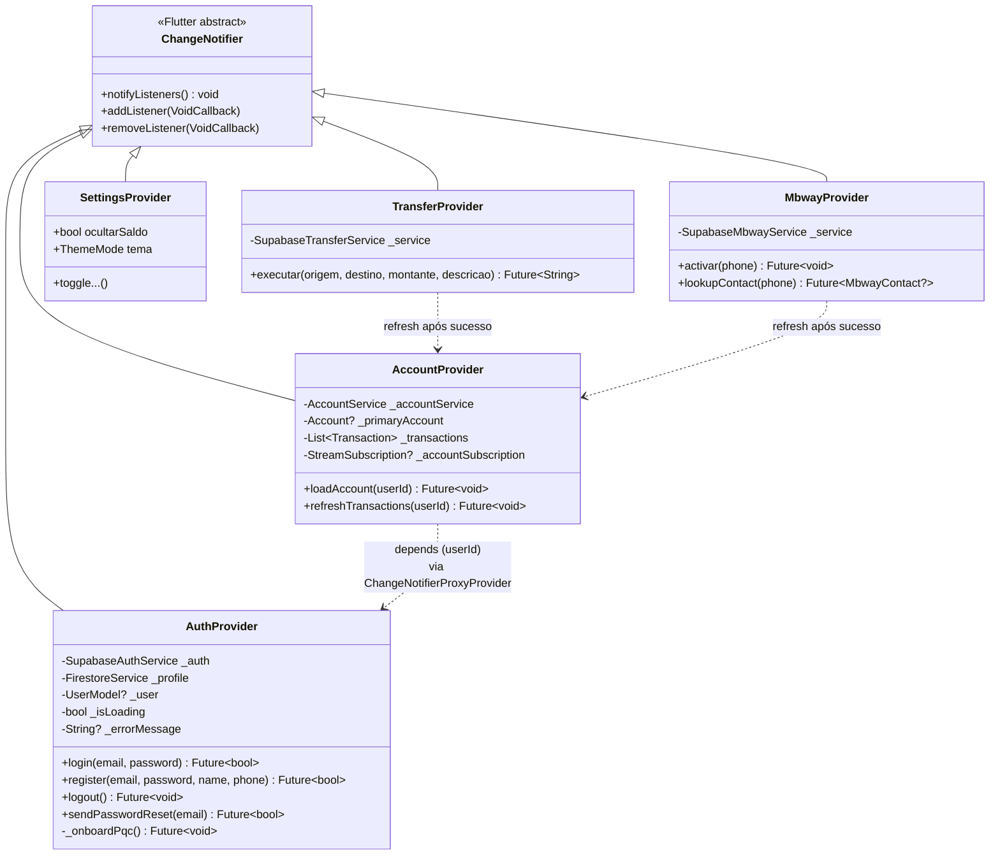

---

## 10. Diagrama Entidade-Relacionamento — Schema Postgres

Tabelas principais. 15 tabelas no total — aqui as 8 críticas para o pipeline PQC + banca.

```mermaid
erDiagram
    auth_users ||--|| users : "1:1"
    users ||--o{ accounts : "1:N"
    users ||--o{ flutter_client_keys : "1:N (histórico)"
    accounts ||--o{ transactions : "1:N"
    accounts ||--o| mbway_phones : "1:1 opcional"
    users ||--o{ mbway_contacts : "1:N (owner)"
    sessions }o--|| users : "N:1"

    auth_users {
        uuid id PK
        text email
        jsonb raw_user_meta_data
    }

    users {
        uuid id PK_FK
        text email
        text nome_completo
        text phone "+351XXXXXXXXX"
        text photo_url
        text pqc_public_key_base64 "legado v1.1"
        timestamptz created_at
    }

    accounts {
        uuid id PK
        uuid user_id FK
        text iban UK "PT50..."
        text nome
        numeric saldo
        text moeda "EUR"
        text tipo "CORRENTE | POUPANCA"
        timestamptz created_at
    }

    transactions {
        uuid id PK
        uuid account_id FK
        text conta_origem_iban
        text conta_destino_iban
        numeric montante "+- (negativo origem)"
        text descricao
        timestamptz timestamp
        bytea nonce
        bytea assinatura_mldsa
        bytea cliente_dsa_public
        text session_id
        text estado "CONFIRMADA | PENDENTE"
    }

    sessions {
        text id PK "UUID"
        uuid user_id FK
        text shared_secret_base64
        bigint expires_at "epoch millis"
        integer last_serial "anti-replay v2"
        timestamptz created_at
    }

    flutter_client_keys {
        uuid user_id FK
        text public_key_base64
        text secret_key_base64 "NULL se device-managed"
        text managed_by "server | device"
        timestamptz revoked_at
        timestamptz migrated_at
        timestamptz criada_em
    }

    mbway_phones {
        text phone PK "+351XXXXXXXXX"
        uuid account_id FK UK
        uuid user_id FK
        boolean ativo
        timestamptz criada_em
    }

    mbway_contacts {
        uuid id PK
        uuid owner_user_id FK
        text name
        text phone
        timestamptz last_used
        integer use_count
    }
```

---

## 11. Diagrama de Fluxo de Dados — Geração de IBAN

Como uma conta nova recebe `PT50 9999 0001 …` válido.

```mermaid
flowchart LR
    Signup(["Auth.signUp(email, password)"]) --> Trigger["TRIGGER on_auth_user_created"]
    Trigger --> Fn["tg_handle_new_user()"]
    Fn --> CheckUser{User existe<br/>em public.users?}
    CheckUser -- não --> InsertUser["INSERT public.users<br/>(id, email, nome)"]
    CheckUser -- sim --> CheckAcc
    InsertUser --> CheckAcc{Já tem<br/>conta?}
    CheckAcc -- sim --> Fim((Fim))
    CheckAcc -- não --> Gen["bjbank_gerar_iban_pt()"]

    subgraph IBAN["Geração IBAN PT"]
        Gen --> P1["banco := '9999'<br/>balcao := '0001'"]
        P1 --> P2["conta := 11×random(0..9)"]
        P2 --> P3["nib_19 := banco ‖ balcao ‖ conta"]
        P3 --> CalcNib["bjbank_calcular_check_nib(nib_19)<br/>algoritmo BdP<br/>Σ(digit×peso) mod 97 → 98-resto"]
        CalcNib --> P4["bban := nib_19 ‖ check_nib"]
        P4 --> CalcIban["bjbank_calcular_iban_check(bban)<br/>MOD-97-10 ISO 7064"]
        CalcIban --> Retorno["RETURN 'PT' ‖ check_iban ‖ bban<br/>(sempre PT50 porque NIB válido)"]
    end

    Retorno --> InsertAcc["INSERT accounts<br/>(user_id, iban, saldo=0, moeda='EUR')"]
    InsertAcc --> Fim
```

---

## 12. Diagrama de Atividade — Anti-replay

Multi-camada: TLS, sessão, timestamp, txId único, serial monotónico.

```mermaid
flowchart TD
    Start([POST executar_transferencia]) --> CheckJWT{JWT válido?}
    CheckJWT -- não --> R401([401 Unauthorized])
    CheckJWT -- sim --> CheckSess{Sessão existe<br/>+ não expirada?}
    CheckSess -- não --> R410([410 Sessão expirada])
    CheckSess -- sim --> CheckOwner{Sessão pertence<br/>ao user JWT?}
    CheckOwner -- não --> R403([403 Forbidden])
    CheckOwner -- sim --> CheckSerial{protocolVersion=2<br/>+ serial > last_serial?}
    CheckSerial -- não --> R409([409 Serial replay])
    CheckSerial -- sim --> Decrypt["AES-256-GCM decrypt envelope"]
    Decrypt -- falha tag --> R400([400 Auth falhou])
    Decrypt -- sucesso --> CheckPubKey{Pubkey enviada =<br/>pubkey_for_user?}
    CheckPubKey -- não registada --> R412([412 Precondition])
    CheckPubKey -- diferente --> R403b([403 Pubkey mismatch])
    CheckPubKey -- igual --> VerifySig{ml_dsa65.verify<br/>OK?}
    VerifySig -- não --> R403c([403 Assinatura inválida])
    VerifySig -- sim --> Canonical{Canonical v2<br/>byte-a-byte =<br/>recebido?}
    Canonical -- não --> R400b([400 Payload não canónico])
    Canonical -- sim --> CheckTime{nowtimestamp\| ≤ 30s?}
    CheckTime -- não --> R400c([400 Replay temporal])
    CheckTime -- sim --> CheckTxId{txId UUID válido<br/>+ não usado?}
    CheckTxId -- duplicado --> R409b([409 UNIQUE violation])
    CheckTxId -- sim --> RPC["RPC executar_transferencia_atomica<br/>(SELECT FOR UPDATE, INSERT)"]
    RPC --> UpdateSerial["UPDATE sessions.last_serial = serial"]
    UpdateSerial --> Ok([200 OK txId])

    classDef rejected fill:#f8d7da,stroke:#dc3545,color:#000
    class R401,R403,R403b,R403c,R409,R409b,R410,R412,R400,R400b,R400c rejected
    classDef ok fill:#d4edda,stroke:#28a745,color:#000
    class Ok ok
```

---

## 13. Diagrama de Sequência — Handshake PFS pós-quântico (KEM v2)

Fluxo **completo** do handshake em modo KEM (Android v1.3.0+). Substitui o flow legado para clientes que declaram `clientKemCapability=true`.

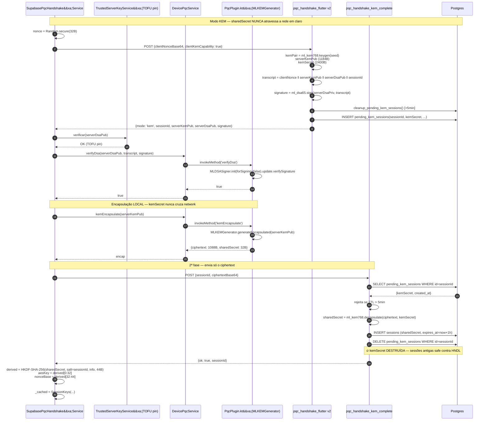

---

## 14. Diagrama Comparativo — Modo legacy vs KEM

Lado a lado o que vai pela rede em cada modo. Visualização imediata da defesa contra HNDL.

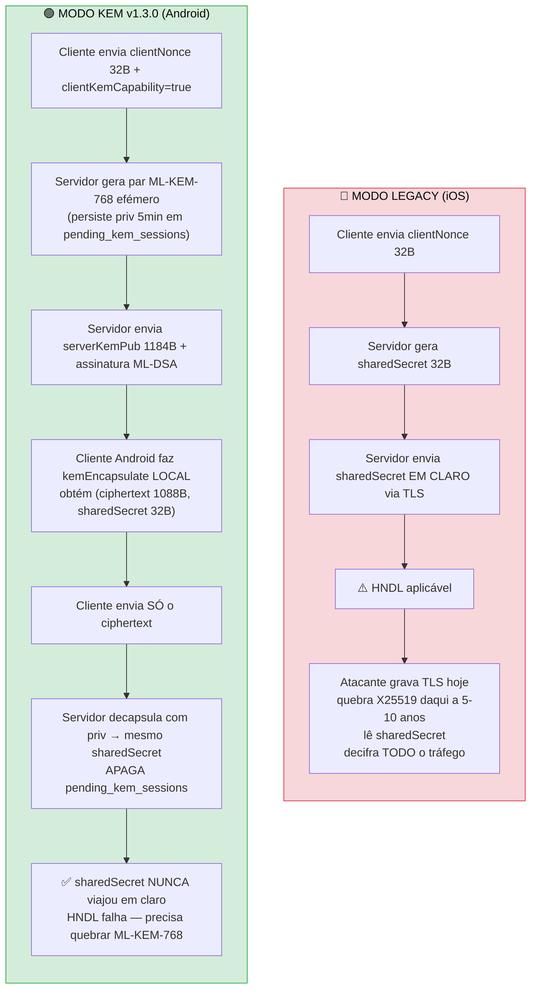

---

## Notas de manutenção

- **Quando refazer**: ao introduzir nova Edge Function, RPC, ou mudança no protocolo wire. Para nova versão do protocolo (ex: v=3 com KEM on-device), adicionar novo diagrama sem apagar o v2.
- **Como editar**: este ficheiro é puro Markdown com blocos Mermaid. GitHub renderiza automaticamente. IDE: instalar extensão "Markdown Preview Mermaid Support".
- **Verificar sintaxe**: <https://mermaid.live/edit>
