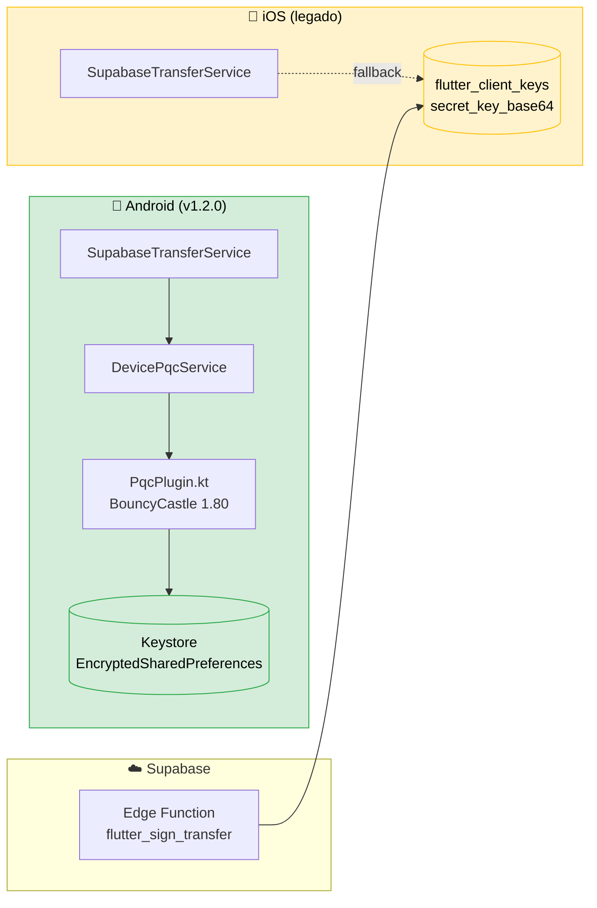

# ADR-001: Estratégia de implementação PQC

**Data**: Maio de 2026 (revisto Junho 2026 — v1.2.0)
**Estado**: Aceite e parcialmente implementado

> **Update Junho 2026**: A decisão original (cripto pós-quântica server-side) foi revertida para Android. ML-DSA-65 e ML-KEM-768 correm agora **no dispositivo** via plugin nativo Kotlin (BouncyCastle 1.80). iOS continua server-managed temporariamente. Ver secção [§7 Revisão Junho 2026](#7-revisão-junho-2026--migração-on-device-android).

## Contexto

O BJBank pretende demonstrar Criptografia Pós-Quântica (ML-KEM-768 + ML-DSA-65, FIPS 203/204) em operações bancárias móveis. A decisão crítica é **onde corre a cripto**: no dispositivo do cliente, no servidor, ou ambos.

A escolha tem impacto directo em:

- Modelo de ameaça (quem tem acesso à chave privada)
- Latência percebida pelo utilizador
- Reprodutibilidade dos resultados experimentais
- Tamanho do binário do app
- Maturidade das bibliotecas disponíveis

## Decisão original (Maio 2026)

**Cripto pós-quântica delegada ao servidor** para a aplicação Flutter, com cripto simétrica (HKDF + AES-GCM) executada localmente. Justificação na altura: `oqs` package (FFI para liboqs) falhava no Android e não havia implementação Dart fiável de ML-DSA/ML-KEM.

### Onde corria cada primitiva (até v1.1.0)

| Primitiva | Localização | Biblioteca |
|---|---|---|
| ML-KEM-768 (lógico no handshake) | Servidor | `@noble/post-quantum 0.4` (Deno) |
| ML-DSA-65 keygen + sign | Servidor | `@noble/post-quantum 0.4` (Deno) |
| ML-DSA-65 verify | Servidor | `@noble/post-quantum 0.4` (Deno) |
| HKDF-SHA-256 | Cliente Flutter | `pointycastle 3.9` |
| AES-256-GCM | Cliente Flutter | `pointycastle 3.9` |
| Web Crypto (decifragem server) | Servidor | Web Crypto API (Deno) |

### Chave privada do utilizador (até v1.1.0)

A chave privada ML-DSA-65 do utilizador era gerada e armazenada na tabela `flutter_client_keys.secret_key_base64` no Supabase, protegida por RLS (acessível apenas via service_role) e usada exclusivamente dentro da Edge Function `flutter_sign_transfer`.

**Limitação reconhecida desde o início**: o servidor é tecnicamente capaz de forjar assinaturas em nome de qualquer utilizador. Quebra o não-repúdio que o ML-DSA deveria garantir. Mitigação prometida: futura migração para HSM ou plugin nativo.

## Justificação

### Por que cripto server-side

- **Inexistência de bibliotecas Dart fiáveis para ML-DSA em Maio de 2026**:
  - `oqs-dart` não compila estavelmente em Android (problemas de FFI com liboqs)
  - `pointycastle` não implementa ML-DSA nem ML-KEM
  - Implementações JavaScript via interop introduzem complexidade e riscos de auditoria
- **Alternativa rejeitada**: FFI manual para liboqs — exigia *build* de liboqs para múltiplas arquiteturas Android + iOS + cross-compilação, esforço de engenharia desproporcional sem valor académico adicional
- **`@noble/post-quantum` é auditado** e está em conformidade com FIPS 203/204
- **Edge Functions Deno** com suporte `npm:` permitem usar a biblioteca directamente, sem builds intermédios
- **Documentação transparente** da limitação na própria aplicação (página "Sobre") e neste ADR

### Modelo de ameaça documentado

Um atacante que comprometa o servidor Supabase tem acesso às chaves privadas dos utilizadores. Esta limitação é:

- **Conhecida** — documentada na app e na dissertação
- **Mitigável em produção** — substituição por HSM (AWS CloudHSM, Azure Key Vault, GCP KMS)
- **Apropriada para o âmbito académico** — permite demonstrar todo o pipeline PQC end-to-end

## Pipeline comum

Independentemente de onde corre cada primitiva, o pipeline lógico é o mesmo:

1. Handshake → derivação HKDF-SHA-256 de chave de sessão
2. Construção de payload canónico (bytes determinísticos)
3. Assinatura ML-DSA-65 do payload
4. Envelope `[payload | signature]`
5. Cifragem AES-256-GCM com IV derivado e AAD = sessionId
6. POST `executar_transferencia` Edge Function
7. Verificação ML-DSA + RPC atómica

## Consequências

### Positivas

- Demonstração end-to-end do pipeline PQC em condições representativas de produção
- Backend Supabase com Edge Functions Deno serve como provedor universal de PQC para outros clientes futuros (Web, outras plataformas Flutter)
- Resultados experimentais reprodutíveis em ambiente conhecido (Deno + V8)

### Negativas

- A variante actual não cumpre o requisito de "chave privada nunca sai do device" típico de carteiras digitais — limitação conhecida e documentada
- Reprodutibilidade dos benchmarks depende do runtime Supabase Edge (Deno 2.1, V8 11.6) — ambiente partilhado com outros tenants

### Mitigações

- A chave privada ML-DSA do utilizador é gerada por seed aleatório `crypto.getRandomValues(32)` e nunca é mostrada nos logs
- O `pqc_public_key_base64` do utilizador é fixado na primeira assinatura (TOFU) — qualquer tentativa de substituição é rejeitada
- Em produção real, esta arquitectura migraria para HSM/KMS

## Alternativas consideradas

| Alternativa | Razão de rejeição |
|---|---|
| FFI manual para liboqs | Esforço de engenharia desproporcional, sem valor académico |
| Implementar ML-DSA em Dart puro | Risco enorme de bugs criptográficos; ~5000 LOC + KAT tests; fora de escopo |
| ml-dsa-js via interop Dart | Performance pior; dependência adicional difícil de auditar |
| Adiar até existir biblioteca Dart fiável | Bloquearia a tese indefinidamente |

## Decisões relacionadas

- **ADR-002 State Management** — Provider escolhido para gestão de estado; cripto fora desse padrão (singletons)
- **ADR-003 Security Strategy** — Modelo de ameaça completo e mitigações em produção

---

## 7. Revisão Junho 2026 — Migração on-device Android

Com a maturidade do **BouncyCastle 1.80** (Dezembro 2024), a API low-level de ML-DSA-65 e ML-KEM-768 ficou estável e disponível em Android nativo. A decisão original foi revertida para a plataforma Android.

### O que mudou

| Aspecto | Antes (v1.1.0) | Depois (v1.2.0 Android) |
|---|---|---|
| Onde corre ML-DSA-65 keygen + sign | Servidor (`flutter_sign_transfer`) | **Dispositivo** (`PqcPlugin.kt`) |
| Onde corre ML-DSA-65 verify (handshake) | Servidor (`verify_dsa`) | **Dispositivo** (`DevicePqcService.verifyDsa`) |
| Onde está a chave privada do utilizador | `flutter_client_keys.secret_key_base64` (Postgres) | `EncryptedSharedPreferences` Keystore-backed |
| Trust boundary | Servidor Supabase | **Dispositivo Android** |
| Não-repúdio efetivo | ❌ Servidor podia forjar | ✅ Só o utilizador pode assinar |
| Plataforma iOS | server-managed | **Mantém server-managed** (falta plugin Swift) |

### Onde corre cada primitiva (v1.2.0 Android)

| Primitiva | Localização | Biblioteca |
|---|---|---|
| ML-DSA-65 keygen | **Dispositivo (Android)** | BouncyCastle 1.80 `MLDSAKeyPairGenerator` |
| ML-DSA-65 sign | **Dispositivo (Android)** | BouncyCastle 1.80 `MLDSASigner` |
| ML-DSA-65 verify (handshake) | **Dispositivo (Android)** | BouncyCastle 1.80 `MLDSASigner` |
| ML-KEM-768 encapsulate | **Dispositivo (Android) — pronto, não usado ainda** | BouncyCastle 1.80 `MLKEMGenerator` |
| ML-KEM-768 keygen + decapsulate (server-side handshake) | Servidor | `@noble/post-quantum 0.4` |
| HKDF-SHA-256 | Cliente Flutter | `pointycastle 3.9` |
| AES-256-GCM | Cliente Flutter | `pointycastle 3.9` |

### Implementação técnica

- **Plugin nativo** `android/app/src/main/kotlin/com/bjbank/ipg/PqcPlugin.kt`:
  - Importa `org.bouncycastle.pqc.crypto.mldsa.*` e `mlkem.*` (low-level — evita SPI overhead).
  - Usa `MLDSAParameters.ml_dsa_65` e `MLKEMParameters.ml_kem_768`.
  - API padrão `Signer` (init → update → generateSignature / verifySignature).
- **Storage da privada**: `EncryptedSharedPreferences` (AES-GCM-256) com `MasterKey.KeyScheme.AES256_GCM` backed pelo `AndroidKeyStore`. Em dispositivos com StrongBox/TEE, a master key é hardware-isolada.
- **Bridge Dart**: `lib/services/device_pqc_service.dart` — singleton com `MethodChannel('com.bjbank.ipg/pqc')`. Métodos: `isAvailable`, `hasKey`, `generateDsaAndGetPublic`, `getPublicKey`, `signDsa`, `verifyDsa`, `kemEncapsulate`, `revokeKey`.
- **Onboarding automático**: `lib/services/device_pqc_onboarding_service.dart` — chamado fire-and-forget após login/signup em `AuthProvider`. Idempotente.
- **Fallback transparente**: `SupabaseTransferService._assinarPayload` tenta primeiro `DevicePqcService.signDsa`; cai para Edge Function `flutter_sign_transfer` se plugin indisponível (iOS, erro nativo).

### Diagrama da nova arquitectura

Ver [`docs/UML_DIAGRAMS.md`](../UML_DIAGRAMS.md) secção 1 (componentes) e secção 4 (sequência de transferência).



### Alternativas reconsideradas

| Alternativa | Estado |
|---|---|
| FFI manual para liboqs | Continua descartado — BC 1.80 resolve o problema sem JNI custom |
| ML-DSA em Dart puro (port de `@noble/post-quantum`) | Considerado para iOS antes do plugin Swift, mas BC via Kotlin é mais rápido (sign 3-5ms vs ~50ms em Dart puro) e tem KAT tests oficiais |
| BC FIPS certificado | Próxima evolução natural quando bc-fips suportar Android API 24+ |

### Trabalho futuro

1. **iOS**: plugin Swift análogo. Opções: libsodium 1.0.21+ (já suporta ML-KEM mas não ML-DSA estável), Swift CryptoKit (espera futura inclusão FIPS 204), ou portar BouncyCastle Java para Swift via Kotlin Multiplatform.
2. ~~**PFS no handshake**~~ → ✅ **Implementado em v1.3.0** — `pqc_handshake_flutter` v2 + `pqc_handshake_kem_complete`. Cliente Android faz `kemEncapsulate` localmente; `sharedSecret` nunca atravessa a rede em claro. Ver §8 abaixo.
3. **Rotação de chaves**: trigger periódico que revoga chaves > 90 dias e força re-onboarding.

Ver `docs/PQC_REMAINING_CRITICAL_ISSUES.md` para detalhe técnico do ponto 1.

---

## 8. Revisão Junho 2026 (v1.3.0) — PFS pós-quântico real

A Edge Function `pqc_handshake_flutter` foi reescrita (v2) e uma nova `pqc_handshake_kem_complete` foi criada para implementar Perfect Forward Secrecy pós-quântico real no Android.

### Protocolo de handshake KEM (Android)

```
1. Cliente envia POST pqc_handshake_flutter {
     clientNonceBase64,
     clientKemCapability: true  ← NOVO em v1.3.0
   }

2. Servidor:
   a. Gera par ML-KEM-768 efémero (ml_kem768.keygen).
   b. INSERT pending_kem_sessions (sessionId, kemSecret, TTL 5min).
   c. Constrói transcript = clientNonce ‖ serverKemPub ‖ serverDsaPub ‖ sessionId
   d. signature = ml_dsa65.sign(serverDsaSecret, transcript)
   e. Retorna { mode: 'kem', sessionId, serverKemPublicBase64,
                serverDsaPublicBase64, signatureBase64 }

3. Cliente (Android):
   a. Verifica assinatura LOCAL via DevicePqcService.verifyDsa.
   b. encap = DevicePqcService.kemEncapsulate(serverKemPub)
      → encap.ciphertext (1088 B), encap.sharedSecret (32 B, fica no device)
   c. POST pqc_handshake_kem_complete { sessionId, ciphertextBase64 }

4. Servidor (pqc_handshake_kem_complete):
   a. SELECT pending_kem_sessions WHERE id=sessionId
   b. Valida TTL ≤ 5min.
   c. sharedSecret = ml_kem768.decapsulate(ciphertext, kemSecret)
   d. INSERT sessions (sharedSecret, expires_at=now+1h)
   e. DELETE pending_kem_sessions WHERE id=sessionId  ← privada destruída
   f. Retorna { ok: true, sessionId }

5. Cliente deriva chaves AES com HKDF(sharedSecret, salt=sessionId, ...).
```

### Modelo de ameaça actualizado

| Atacante | Modo legacy (iOS) | Modo KEM (Android v1.3.0) |
|---|---|---|
| Quebra X25519 retroactivamente (HNDL) | ❌ Recupera sharedSecret em claro | ✅ Só vê ciphertext + serverKemPub; precisa também quebrar ML-KEM-768 |
| Comprometer servidor > 5min após handshake | n/a | ✅ kemSecret apagada; sessões antigas seguras |
| Comprometer servidor durante janela 5min | n/a | ⚠️ Compromete sessão em curso |
| MitM no handshake | TOFU pin + ML-DSA verify | ✅ Mesmo + verify local Android |

### Compatibilidade

- **Backwards-compatible**: cliente sem `DevicePqcService.isAvailable()` (iOS) envia `clientKemCapability: false` → recebe `{mode: 'legacy', sharedSecretBase64, ...}` exactamente como em v1.2.0.
- **Edge Function v2 detecta a flag e responde no modo apropriado.** Mesma URL, mesma autenticação, schema de resposta diferenciado pelo campo `mode`.

### Trabalho futuro residual

- iOS migrar para modo KEM (depende do plugin Swift).
- Hybrid X25519 + ML-KEM-768 (NIST recomendado): cliente faria os dois KEMs em paralelo e derivaria `sharedSecret = HKDF(ss_x25519 ‖ ss_kyber768)`. Mais robusto contra falhas em qualquer dos algoritmos.
