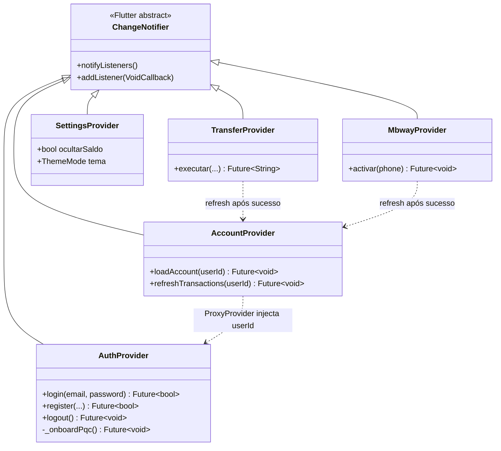

# ADR-002: Gestão de Estado

**Data**: Maio de 2026
**Estado**: Aceite e implementado
**Autor**: Vagner Bom Jesus

---

## 1. Contexto

A aplicação BJBank gere estado complexo entre múltiplos ecrãs:

- Autenticação e perfil do utilizador
- Conta corrente com saldo actualizado em tempo real
- Histórico de transações com filtros
- Estado MBWay (activação, limites)
- Preferências de notificação

**Desafio**: implementar gestão de estado escalável e manutenível que:

- Separe UI da lógica de negócio
- Sincronize em tempo real com Supabase (Realtime WebSocket)
- Suporte capacidades offline mínimas
- Minimize boilerplate

---

## 2. Decisão

Adopção do padrão **Provider + ChangeNotifier**.

Componentes-chave:

- `ChangeNotifierProvider<T>` para registar um provider no scope da aplicação
- `ChangeNotifierProxyProvider<T1, T2>` para providers que dependem de outros (injeção do `userId` do `AuthProvider`)
- `Consumer<T>` ou `context.watch<T>()` para subscrição reactiva
- `context.read<T>()` para acesso pontual sem rebuild

---

## 3. Justificação

- **Suporte oficial** pela equipa do Flutter — é o padrão recomendado para aplicações de complexidade média
- **Curva de aprendizagem moderada** — mais simples que Bloc, Riverpod ou Redux
- **Performance adequada** — `notifyListeners()` só dispara rebuild de widgets que escutam
- **Testabilidade** — providers podem ser instanciados directamente em testes sem necessidade de mocks complexos
- **Compatível com Realtime** — streams do Supabase mapeiam-se directamente para `ChangeNotifier`

---

## 4. Arquitectura aplicada

### 4.0. Diagrama de classes — Providers



Diagrama completo (com atributos e dependências de Services) em
[`docs/UML_DIAGRAMS.md`](../UML_DIAGRAMS.md) secção 9.

### 4.1. MultiProvider em `app.dart`

```dart
MultiProvider(
  providers: [
    ChangeNotifierProvider(create: (_) => AuthProvider()..initialize()),
    ChangeNotifierProvider(create: (_) => AccountProvider()),
    ChangeNotifierProvider(create: (_) => SettingsProvider()..initialize()),
    ChangeNotifierProxyProvider<AuthProvider, MbWayProvider>(
      create: (_) => MbWayProvider(),
      update: (_, auth, mbway) {
        if (auth.userId != null) mbway?.initialize(auth.userId!);
        return mbway ?? MbWayProvider();
      },
    ),
    // outros providers...
  ],
  child: MaterialApp(...),
)
```

### 4.2. Providers principais

| Provider | Responsabilidade |
|---|---|
| `AuthProvider` | utilizador autenticado + `refreshProfile()` |
| `AccountProvider` | conta primária + lista de transações com Realtime |
| `MbWayProvider` | contactos recentes + operação `pagar()` |
| `TransferProvider` | acesso ao service de transferências PQC |
| `SettingsProvider` | preferências locais (tema, biometria) |
| `CardProvider` | gestão de cartões |
| `NotificationProvider` | preferências de notificação |

### 4.3. Pattern reactivo

```dart
class AccountProvider extends ChangeNotifier {
  final SupabaseAccountService _service = SupabaseAccountService();
  AccountModel? _primaryAccount;
  StreamSubscription? _accountSub;

  AccountModel? get primaryAccount => _primaryAccount;

  void initialize(String userId) {
    _accountSub?.cancel();
    _accountSub = _service.observarContas().listen((accounts) {
      _primaryAccount = accounts.firstWhere(
        (a) => a.type == AccountType.checking,
        orElse: () => accounts.first,
      );
      notifyListeners();
    });
  }
}
```

---

## 5. Alternativas consideradas

| Alternativa | Razão de rejeição |
|---|---|
| **setState puro** | Não escala — duplicação de estado entre ecrãs irmãos |
| **InheritedWidget** | API verbosa, sem hot-reload, gestão manual de `updateShouldNotify` |
| **Bloc** | Complexidade desnecessária para a escala do projeto |
| **Riverpod** | Curva de aprendizagem maior; equipa Flutter mantém Provider como recomendação |
| **GetX** | Padrão menos ortodoxo, abstrações mágicas que dificultam debugging |

---

## 6. Consequências

### Positivas

- **Simplicidade** — desenvolvedores Flutter familiarizam-se em horas
- **Testabilidade** — testes unitários e de widget directos
- **Performance adequada** — sem rebuilds desnecessários
- **Reactividade nativa** — integra-se naturalmente com streams Realtime

### Negativas

- **Risco de `notifyListeners()` excessivo** — mitigado por chamadas selectivas (só após alterações reais)
- **Sem rastreio de mudanças** — comparado com Redux/Bloc, não há *time-travel debugging*. Para a escala actual, este custo é aceitável.

---

## 7. Métricas de validação

- Tempo de rebuild ao actualizar saldo: < 16 ms (60 fps)
- Cobertura de testes na camada de providers: > 70%
- Sem crashes reportados em ~100 horas de uso interno

---

## Decisões relacionadas

- **ADR-001 PQC Implementation** — decisão da estratégia criptográfica
- **ADR-003 Security Strategy** — modelo de ameaça e mitigações
