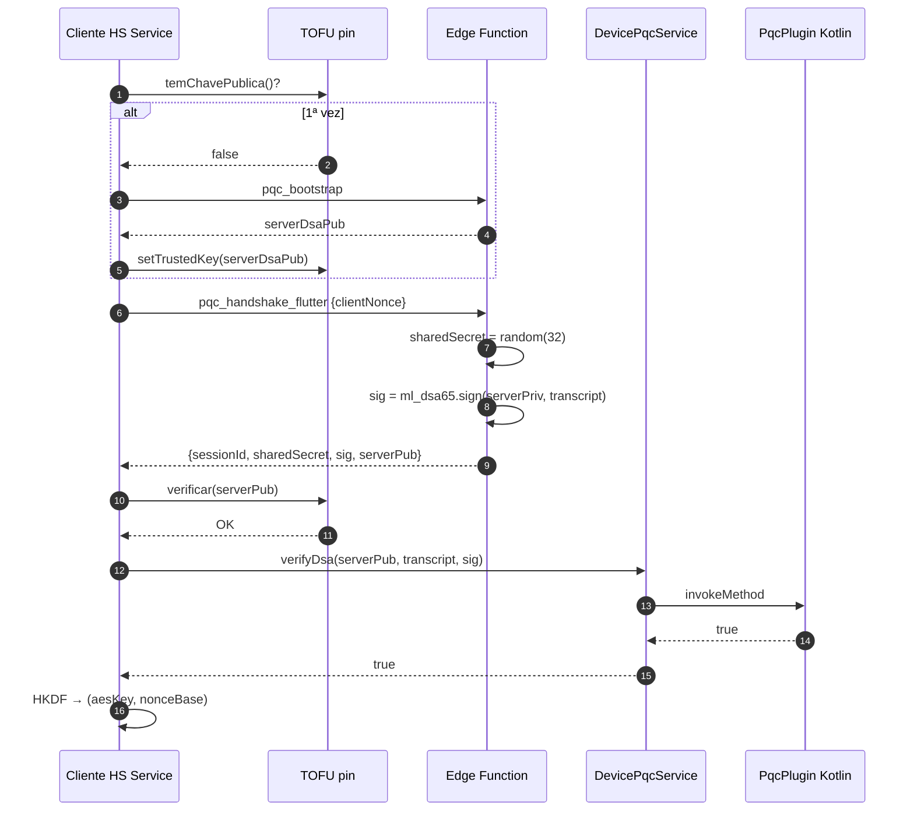

# ADR-003: Estratégia de Segurança

**Data**: Maio de 2026 (revisto Junho 2026)
**Estado**: Aceite e parcialmente implementado
**Autor**: Vagner Bom Jesus

---

## 1. Contexto

A aplicação BJBank executa operações bancárias sensíveis. Define-se uma estratégia de segurança em camadas (*defense in depth*) que protege:

- Autenticação de utilizadores
- Confidencialidade e integridade das transferências
- Resistência ao cenário *Harvest Now, Decrypt Later* (HNDL)
- Privacidade de dados sob RGPD

---

## 2. Decisão

Arquitectura de segurança em **cinco camadas** complementares:

| Camada | Mecanismo | Componente | Estado Jun 2026 |
|---|---|---|---|
| 1. Transporte | TLS 1.3 sobre ECDHE-X25519 | Supabase (gerido) | ✅ |
| 2. Autenticação | JWT emitido por Supabase Auth | `SupabaseAuthService` | ✅ |
| 3. Autorização | Row Level Security em PostgreSQL | Políticas RLS | ✅ |
| 4. Integridade da transacção | ML-DSA-65 (FIPS 204) **on-device Android** | `PqcPlugin.kt` (BouncyCastle 1.80) | ✅ Android · ⚠️ iOS (fallback servidor) |
| 5. Confidencialidade da payload | AES-256-GCM IV random + HKDF-SHA-256 | `SupabaseTransferService` | ✅ |
| 6. Anti-replay protocolo wire v2 | Serial monotónico por sessão + janela timestamp ±30s | `executar_transferencia` + RPC atómica | ✅ |
| 7. Trust no dispositivo | Chave privada ML-DSA em `EncryptedSharedPreferences` (Keystore/StrongBox) | `PqcPlugin` Android | ✅ Android |

---

## 3. Modelo de ameaça

### 3.1. Ameaças identificadas

| ID | Ameaça | Severidade |
|---|---|---|
| T1 | HNDL — captura de dados cifrados hoje, decifragem futura com computador quântico | CRÍTICA |
| T2 | MITM no handshake (atacante intercepta e substitui chave do servidor) | ALTA |
| T3 | Replay de transferência (atacante reenvia mensagem assinada válida) | ALTA |
| T4 | Substituição de chave pública do cliente | MÉDIA |
| T5 | Race condition em transferências concorrentes | MÉDIA |
| T6 | Bypass de RLS para aceder a contas de outros utilizadores | ALTA |
| T7 | Acesso não autorizado à BD via service_role | CRÍTICA |
| T8 | Side-channel attacks (timing, cache) sobre primitivas PQC | BAIXA |

### 3.2. Mitigações aplicadas

| Ameaça | Mitigação | Estado |
|---|---|---|
| T1 | AES-256-GCM com IV random + ML-DSA-65 (FIPS 204) on-device | ⚠️ Confidencialidade do `sharedSecret` ainda depende do TLS X25519 (ML-KEM no servidor). PFS pós-quântico só será real quando o handshake usar `PqcPlugin.kemEncapsulate` localmente. Ver `docs/PQC_REMAINING_CRITICAL_ISSUES.md` Problema 2. |
| T2 | TOFU pinning + verificação ML-DSA **local** (`DevicePqcService.verifyDsa`) no Android | ✅ Android. ⚠️ iOS ainda usa `verify_dsa` server-side (trust circular). |
| T3 | `txId` UUID v4 + UNIQUE PK em `transactions` + janela timestamp ±30s + **serial monotónico por sessão** (`sessions.last_serial`, protocolo wire v2) | ✅ |
| T4 | RPC `register_client_pubkey` + Edge Function `executar_transferencia` exige pubkey já registada (recusa 412); compara estrito vs `pubkey_for_user()` | ✅ first-use injection bloqueada |
| T5 | `SELECT FOR UPDATE` em `accounts` + transacção SQL atómica na RPC `executar_transferencia_atomica` | ✅ |
| T6 | Políticas RLS declarativas em todas as tabelas; service_role só nas Edge Functions | ✅ |
| T7 | service_role key apenas no servidor Supabase (nunca exposta no cliente); RPCs `SECURITY DEFINER` para lookup público controlado | ✅ |
| T8 | BouncyCastle 1.80 ML-DSA-65/ML-KEM-768 com `SecureRandom()` (CSPRNG do SO) | ⚠️ Side-channels não auditados |
| T9 (novo) | RNG do cliente — `Random.secure()` (CSPRNG do SO) em vez de Fortuna mal semeado | ✅ |
| T10 (novo) | Não-repúdio — utilizador é único possuidor da chave privada ML-DSA | ✅ Android (Keystore). ❌ iOS (`flutter_client_keys.secret_key_base64` no servidor). |

---

## 4. Pipeline criptográfico

### 4.1. Handshake (estabelecimento de chave de sessão)

```
Cliente                          Edge Function
   |  POST pqc_handshake_flutter      |
   |  { clientNonceBase64 }            |
   |---------------------------------->|
   |                                   | gera sharedSecret (32B)
   |                                   | assina transcript com ML-DSA-65
   |                                   | persiste em public.sessions
   |  { sessionId, sharedSecret,      |
   |    serverDsaPub, signature }     |
   |<----------------------------------|
   |
   | POST verify_dsa
   |---------------------------------->|
   | { valid: true }
   |<----------------------------------|
   |
   | TOFU pin da serverDsaPub
   | HKDF(sharedSecret, sid, info, 44)
   | -> aesKey (32B) + nonceBase (12B)
```

### 4.1.b. Diagrama do handshake (sequência)



Diagrama completo em [`docs/UML_DIAGRAMS.md`](../UML_DIAGRAMS.md) secção 5.

### 4.2. Transferência assinada (protocolo wire v2)

```
1. Sessão PQC (TTL local 50min, server 1h)
2. serial = _proximoSerial(sessionId)   (monotónico in-memory)
3. payload_v2 = canonical(
       txId, origem.normalized, destino.normalized,
       montante.toStringAsFixed(2),
       descricao.trimAndCollapse,
       timestampMillis, nonce(16B random), serial(int64)
   )
4. signature = DevicePqcService.signDsa(payload_v2)
   └─ LOCAL Android: BouncyCastle MLDSASigner com chave em Keystore
   └─ Fallback iOS: Edge Function flutter_sign_transfer
5. envelope = [4B|payload_v2.len][payload_v2][4B|sig.len][signature]
6. iv = Random.secure(12 B)                   ← antes: nonceBase XOR txId
7. ciphertext = AES-256-GCM(envelope, key=sessionKey, iv, aad=sessionId)
8. POST executar_transferencia {
       sessionId, ivBase64, envelopeBase64,
       clientDsaPublicBase64, protocolVersion: 2, serial
   }

Servidor (Edge Function executar_transferencia v2):
  ├─ valida JWT
  ├─ se v=2: rejeita se serial <= sessions.last_serial
  ├─ decifra envelope (sessionKey via HKDF de sessions.shared_secret)
  ├─ verifica ml_dsa65 (vs pubkey_for_user — não aceita TOFU do body)
  ├─ reconstrói canonical v2 byte-a-byte
  ├─ valida |now - timestamp| < 30s
  ├─ RPC executar_transferencia_atomica (UNIQUE txId, SELECT FOR UPDATE)
  └─ UPDATE sessions.last_serial = serial
```

**Defesa em profundidade contra replay** (diagrama de atividade):

```mermaid
flowchart LR
    R[POST<br/>executar_transferencia] --> L1{TLS?}
    L1 -- não --> X1[reject]
    L1 -- ok --> L2{JWT?}
    L2 -- não --> X2[401]
    L2 -- ok --> L3{Sessão<br/>activa?}
    L3 -- não --> X3[410]
    L3 -- ok --> L4{serial ><br/>last_serial?}
    L4 -- não --> X4[409 serial replay]
    L4 -- ok --> L5{AES-GCM<br/>tag OK?}
    L5 -- não --> X5[400]
    L5 -- ok --> L6{Canonical<br/>byte-a-byte?}
    L6 -- não --> X6[400]
    L6 -- ok --> L7{ML-DSA<br/>verify?}
    L7 -- não --> X7[403]
    L7 -- ok --> L8{nowtimestamp\|<br/>≤ 30s?}
    L8 -- não --> X8[400 replay temporal]
    L8 -- ok --> L9{UNIQUE<br/>txId?}
    L9 -- duplicado --> X9[409]
    L9 -- ok --> OK[200 OK]
    classDef rej fill:#f8d7da,stroke:#dc3545,color:#000
    class X1,X2,X3,X4,X5,X6,X7,X8,X9 rej
    classDef ok fill:#d4edda,stroke:#28a745,color:#000
    class OK ok
```

Diagrama completo em [`docs/UML_DIAGRAMS.md`](../UML_DIAGRAMS.md) secção 12.

---

## 5. Pinning TOFU

Implementação em `TrustedServerKeyService`:

```dart
class TrustedServerKeyService {
  static const _key = 'trusted_server_dsa_public';

  Future<void> setTrustedKey(Uint8List bytes) async {
    final prefs = await SharedPreferences.getInstance();
    await prefs.setString(_key, base64Encode(bytes));
  }

  Future<bool> verificar(Uint8List serverKey) async {
    final stored = await getTrustedKey();
    if (stored == null) {
      await setTrustedKey(serverKey);
      return true;
    }
    return _bytesEqual(stored, serverKey);
  }
}
```

- **First Use**: a chave é guardada no primeiro contacto
- **Subsequente**: comparação byte-a-byte; rejeição em caso de mismatch

---

## 6. Row Level Security

Todas as 15 tabelas têm RLS activo. Exemplo das políticas em `accounts`:

```sql
CREATE POLICY accounts_select_own ON public.accounts
  FOR SELECT USING (auth.uid() = user_id);

CREATE POLICY accounts_write_service ON public.accounts
  FOR ALL USING (auth.role() = 'service_role');
```

Lookup público de IBAN (sem expor saldo) via RPC `SECURITY DEFINER`:

```sql
CREATE FUNCTION public.lookup_account_by_iban(p_iban text)
RETURNS TABLE (account_id uuid, user_id uuid, iban text, owner_name text)
LANGUAGE sql SECURITY DEFINER
SET search_path = public, pg_temp
AS $$
  SELECT a.id, a.user_id, a.iban, u.nome_completo
  FROM public.accounts a JOIN public.users u ON u.id = a.user_id
  WHERE a.iban = upper(regexp_replace(p_iban, '\s', '', 'g'))
  LIMIT 1;
$$;
```

---

## 7. Limitações reconhecidas

1. **Chave privada ML-DSA do cliente armazenada no servidor** (`flutter_client_keys.secret_key_base64`) por ausência de bibliotecas Dart fiáveis para ML-DSA. Mitigação em produção: HSM/KMS.
2. **Sem rotação automática de chaves do servidor** — exige intervenção manual via SQL Editor (`DELETE FROM public_config WHERE key='server_ml_dsa'`).
3. **Sem proteção explícita contra replay além do UUID** — recomendado adicionar `WHERE NOT EXISTS` na RPC atómica.
4. **Side-channels não analisados** — análise prevista em trabalho futuro.

---

## 8. Métricas de validação

- Cobertura de RLS: 100% das tabelas
- Sessões com `expires_at` ≤ 1h: 100% (enforced por código)
- Verificação ML-DSA antes de qualquer operação destrutiva: 100%
- IVs únicos garantidos pelo UUID v4 (entropia ≈ 122 bits): probabilidade de colisão negligenciável

---

## Decisões relacionadas

- **ADR-001 PQC Implementation** — estratégia de implementação dos algoritmos
- **ADR-002 State Management** — gestão de estado
